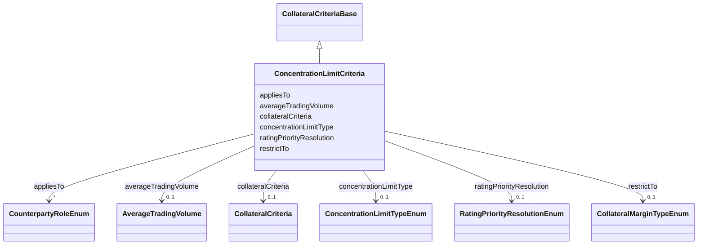

```mermaid
 classDiagram
    class ConcentrationLimitCriteria
    click ConcentrationLimitCriteria href "../ConcentrationLimitCriteria"
      CollateralCriteriaBase <|-- ConcentrationLimitCriteria
        click CollateralCriteriaBase href "../CollateralCriteriaBase"
      
      ConcentrationLimitCriteria : appliesTo
        
          
    
        
        
        ConcentrationLimitCriteria --> "*" CounterpartyRoleEnum : appliesTo
        click CounterpartyRoleEnum href "../CounterpartyRoleEnum"
    

        
      ConcentrationLimitCriteria : averageTradingVolume
        
          
    
        
        
        ConcentrationLimitCriteria --> "0..1" AverageTradingVolume : averageTradingVolume
        click AverageTradingVolume href "../AverageTradingVolume"
    

        
      ConcentrationLimitCriteria : collateralCriteria
        
          
    
        
        
        ConcentrationLimitCriteria --> "0..1" CollateralCriteria : collateralCriteria
        click CollateralCriteria href "../CollateralCriteria"
    

        
      ConcentrationLimitCriteria : concentrationLimitType
        
          
    
        
        
        ConcentrationLimitCriteria --> "0..1" ConcentrationLimitTypeEnum : concentrationLimitType
        click ConcentrationLimitTypeEnum href "../ConcentrationLimitTypeEnum"
    

        
      ConcentrationLimitCriteria : ratingPriorityResolution
        
          
    
        
        
        ConcentrationLimitCriteria --> "0..1" RatingPriorityResolutionEnum : ratingPriorityResolution
        click RatingPriorityResolutionEnum href "../RatingPriorityResolutionEnum"
    

        
      ConcentrationLimitCriteria : restrictTo
        
          
    
        
        
        ConcentrationLimitCriteria --> "0..1" CollateralMarginTypeEnum : restrictTo
        click CollateralMarginTypeEnum href "../CollateralMarginTypeEnum"
    

        
      
```
