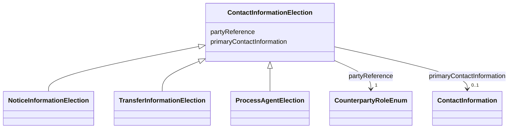

```mermaid
 classDiagram
    class ContactInformationElection
    click ContactInformationElection href "../ContactInformationElection"
      ContactInformationElection <|-- NoticeInformationElection
        click NoticeInformationElection href "../NoticeInformationElection"
      ContactInformationElection <|-- TransferInformationElection
        click TransferInformationElection href "../TransferInformationElection"
      ContactInformationElection <|-- ProcessAgentElection
        click ProcessAgentElection href "../ProcessAgentElection"
      
      ContactInformationElection : partyReference
        
          
    
        
        
        ContactInformationElection --> "1" CounterpartyRoleEnum : partyReference
        click CounterpartyRoleEnum href "../CounterpartyRoleEnum"
    

        
      ContactInformationElection : primaryContactInformation
        
          
    
        
        
        ContactInformationElection --> "0..1" ContactInformation : primaryContactInformation
        click ContactInformation href "../ContactInformation"
    

        
      
```
