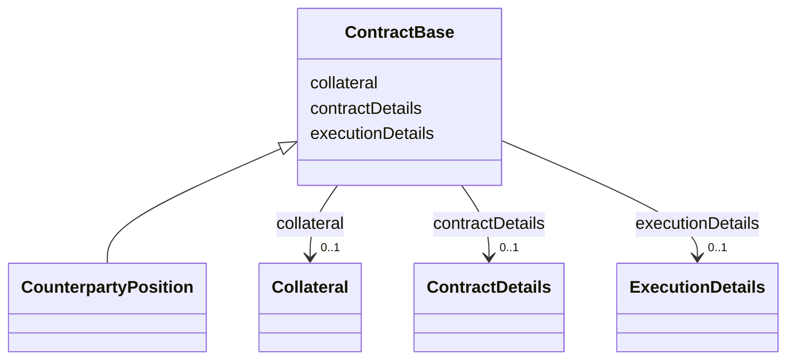

```mermaid
 classDiagram
    class ContractBase
    click ContractBase href "../ContractBase"
      ContractBase <|-- CounterpartyPosition
        click CounterpartyPosition href "../CounterpartyPosition"
      
      ContractBase : collateral
        
          
    
        
        
        ContractBase --> "0..1" Collateral : collateral
        click Collateral href "../Collateral"
    

        
      ContractBase : contractDetails
        
          
    
        
        
        ContractBase --> "0..1" ContractDetails : contractDetails
        click ContractDetails href "../ContractDetails"
    

        
      ContractBase : executionDetails
        
          
    
        
        
        ContractBase --> "0..1" ExecutionDetails : executionDetails
        click ExecutionDetails href "../ExecutionDetails"
    

        
      
```
