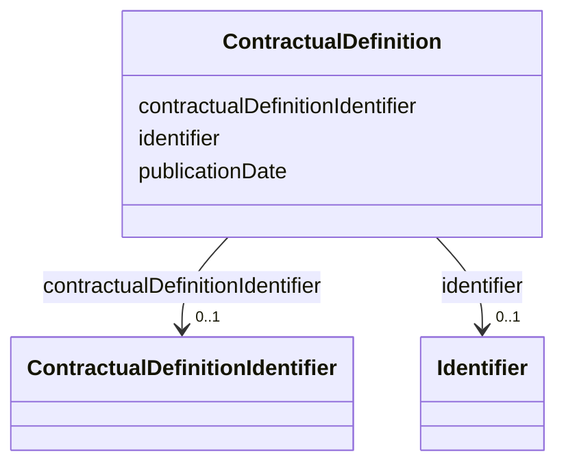

```mermaid
 classDiagram
    class ContractualDefinition
    click ContractualDefinition href "../ContractualDefinition"
      ContractualDefinition : contractualDefinitionIdentifier
        
          
    
        
        
        ContractualDefinition --> "0..1" ContractualDefinitionIdentifier : contractualDefinitionIdentifier
        click ContractualDefinitionIdentifier href "../ContractualDefinitionIdentifier"
    

        
      ContractualDefinition : identifier
        
          
    
        
        
        ContractualDefinition --> "0..1" Identifier : identifier
        click Identifier href "../Identifier"
    

        
      ContractualDefinition : publicationDate
        
      
```
