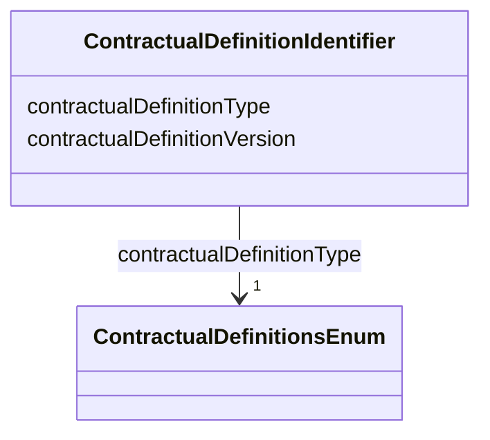

```mermaid
 classDiagram
    class ContractualDefinitionIdentifier
    click ContractualDefinitionIdentifier href "../ContractualDefinitionIdentifier"
      ContractualDefinitionIdentifier : contractualDefinitionType
        
          
    
        
        
        ContractualDefinitionIdentifier --> "1" ContractualDefinitionsEnum : contractualDefinitionType
        click ContractualDefinitionsEnum href "../ContractualDefinitionsEnum"
    

        
      ContractualDefinitionIdentifier : contractualDefinitionVersion
        
      
```
