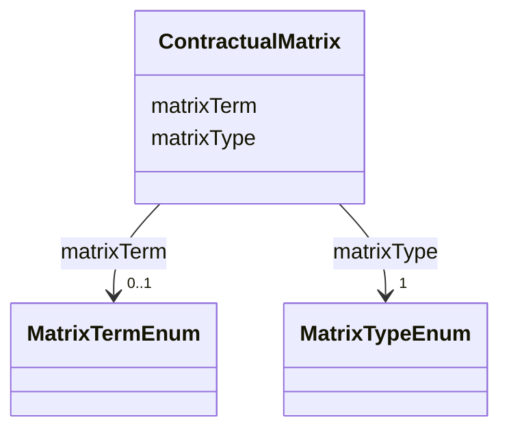

```mermaid
 classDiagram
    class ContractualMatrix
    click ContractualMatrix href "../ContractualMatrix"
      ContractualMatrix : matrixTerm
        
          
    
        
        
        ContractualMatrix --> "0..1" MatrixTermEnum : matrixTerm
        click MatrixTermEnum href "../MatrixTermEnum"
    

        
      ContractualMatrix : matrixType
        
          
    
        
        
        ContractualMatrix --> "1" MatrixTypeEnum : matrixType
        click MatrixTypeEnum href "../MatrixTypeEnum"
    

        
      
```
