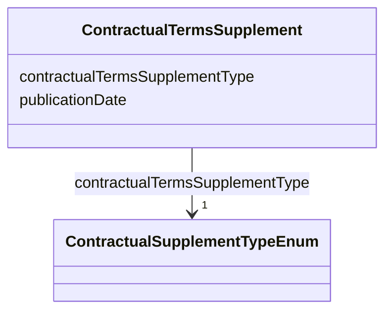

```mermaid
 classDiagram
    class ContractualTermsSupplement
    click ContractualTermsSupplement href "../ContractualTermsSupplement"
      ContractualTermsSupplement : contractualTermsSupplementType
        
          
    
        
        
        ContractualTermsSupplement --> "1" ContractualSupplementTypeEnum : contractualTermsSupplementType
        click ContractualSupplementTypeEnum href "../ContractualSupplementTypeEnum"
    

        
      ContractualTermsSupplement : publicationDate
        
      
```
