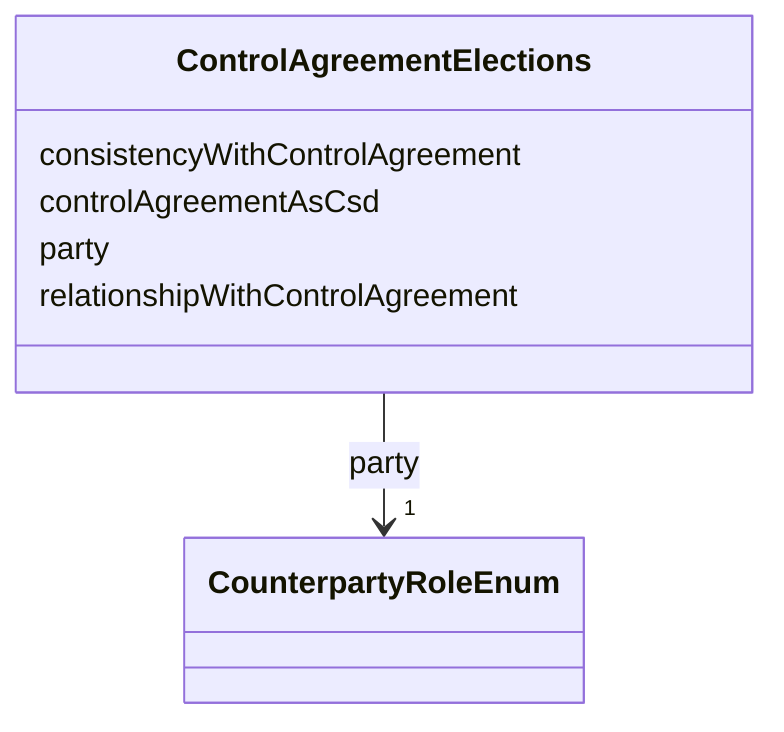

```mermaid
 classDiagram
    class ControlAgreementElections
    click ControlAgreementElections href "../ControlAgreementElections"
      ControlAgreementElections : consistencyWithControlAgreement
        
      ControlAgreementElections : controlAgreementAsCsd
        
      ControlAgreementElections : party
        
          
    
        
        
        ControlAgreementElections --> "1" CounterpartyRoleEnum : party
        click CounterpartyRoleEnum href "../CounterpartyRoleEnum"
    

        
      ControlAgreementElections : relationshipWithControlAgreement
        
      
```
