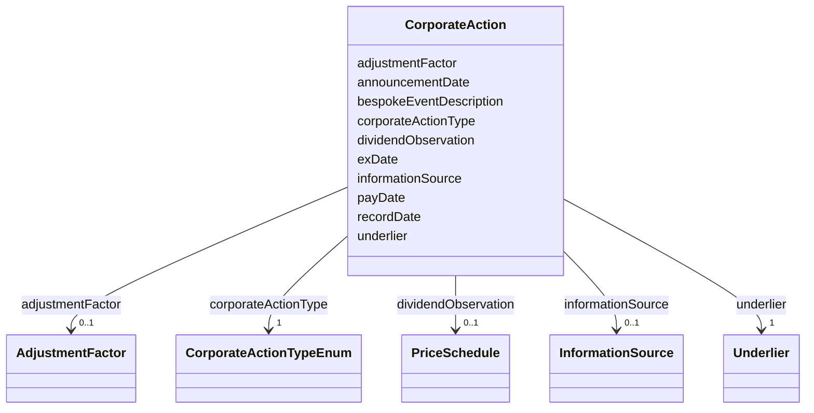

```mermaid
 classDiagram
    class CorporateAction
    click CorporateAction href "../CorporateAction"
      CorporateAction : adjustmentFactor
        
          
    
        
        
        CorporateAction --> "0..1" AdjustmentFactor : adjustmentFactor
        click AdjustmentFactor href "../AdjustmentFactor"
    

        
      CorporateAction : announcementDate
        
      CorporateAction : bespokeEventDescription
        
      CorporateAction : corporateActionType
        
          
    
        
        
        CorporateAction --> "1" CorporateActionTypeEnum : corporateActionType
        click CorporateActionTypeEnum href "../CorporateActionTypeEnum"
    

        
      CorporateAction : dividendObservation
        
          
    
        
        
        CorporateAction --> "0..1" PriceSchedule : dividendObservation
        click PriceSchedule href "../PriceSchedule"
    

        
      CorporateAction : exDate
        
      CorporateAction : informationSource
        
          
    
        
        
        CorporateAction --> "0..1" InformationSource : informationSource
        click InformationSource href "../InformationSource"
    

        
      CorporateAction : payDate
        
      CorporateAction : recordDate
        
      CorporateAction : underlier
        
          
    
        
        
        CorporateAction --> "1" Underlier : underlier
        click Underlier href "../Underlier"
    

        
      
```
