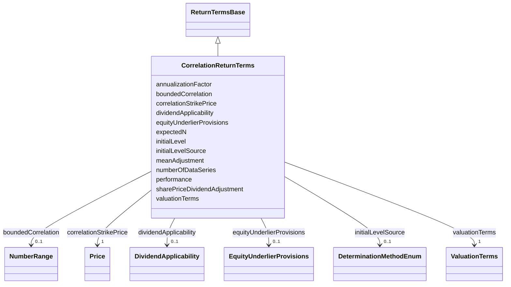

```mermaid
 classDiagram
    class CorrelationReturnTerms
    click CorrelationReturnTerms href "../CorrelationReturnTerms"
      ReturnTermsBase <|-- CorrelationReturnTerms
        click ReturnTermsBase href "../ReturnTermsBase"
      
      CorrelationReturnTerms : annualizationFactor
        
      CorrelationReturnTerms : boundedCorrelation
        
          
    
        
        
        CorrelationReturnTerms --> "0..1" NumberRange : boundedCorrelation
        click NumberRange href "../NumberRange"
    

        
      CorrelationReturnTerms : correlationStrikePrice
        
          
    
        
        
        CorrelationReturnTerms --> "1" Price : correlationStrikePrice
        click Price href "../Price"
    

        
      CorrelationReturnTerms : dividendApplicability
        
          
    
        
        
        CorrelationReturnTerms --> "0..1" DividendApplicability : dividendApplicability
        click DividendApplicability href "../DividendApplicability"
    

        
      CorrelationReturnTerms : equityUnderlierProvisions
        
          
    
        
        
        CorrelationReturnTerms --> "0..1" EquityUnderlierProvisions : equityUnderlierProvisions
        click EquityUnderlierProvisions href "../EquityUnderlierProvisions"
    

        
      CorrelationReturnTerms : expectedN
        
      CorrelationReturnTerms : initialLevel
        
      CorrelationReturnTerms : initialLevelSource
        
          
    
        
        
        CorrelationReturnTerms --> "0..1" DeterminationMethodEnum : initialLevelSource
        click DeterminationMethodEnum href "../DeterminationMethodEnum"
    

        
      CorrelationReturnTerms : meanAdjustment
        
      CorrelationReturnTerms : numberOfDataSeries
        
      CorrelationReturnTerms : performance
        
      CorrelationReturnTerms : sharePriceDividendAdjustment
        
      CorrelationReturnTerms : valuationTerms
        
          
    
        
        
        CorrelationReturnTerms --> "1" ValuationTerms : valuationTerms
        click ValuationTerms href "../ValuationTerms"
    

        
      
```
