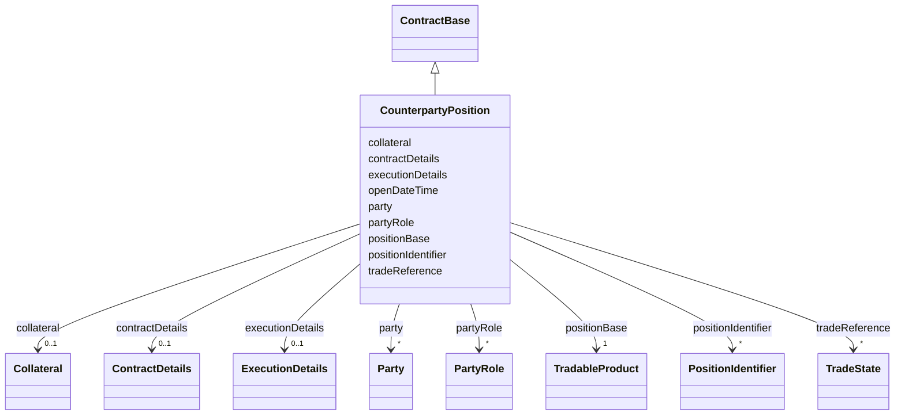

```mermaid
 classDiagram
    class CounterpartyPosition
    click CounterpartyPosition href "../CounterpartyPosition"
      ContractBase <|-- CounterpartyPosition
        click ContractBase href "../ContractBase"
      
      CounterpartyPosition : collateral
        
          
    
        
        
        CounterpartyPosition --> "0..1" Collateral : collateral
        click Collateral href "../Collateral"
    

        
      CounterpartyPosition : contractDetails
        
          
    
        
        
        CounterpartyPosition --> "0..1" ContractDetails : contractDetails
        click ContractDetails href "../ContractDetails"
    

        
      CounterpartyPosition : executionDetails
        
          
    
        
        
        CounterpartyPosition --> "0..1" ExecutionDetails : executionDetails
        click ExecutionDetails href "../ExecutionDetails"
    

        
      CounterpartyPosition : openDateTime
        
      CounterpartyPosition : party
        
          
    
        
        
        CounterpartyPosition --> "*" Party : party
        click Party href "../Party"
    

        
      CounterpartyPosition : partyRole
        
          
    
        
        
        CounterpartyPosition --> "*" PartyRole : partyRole
        click PartyRole href "../PartyRole"
    

        
      CounterpartyPosition : positionBase
        
          
    
        
        
        CounterpartyPosition --> "1" TradableProduct : positionBase
        click TradableProduct href "../TradableProduct"
    

        
      CounterpartyPosition : positionIdentifier
        
          
    
        
        
        CounterpartyPosition --> "*" PositionIdentifier : positionIdentifier
        click PositionIdentifier href "../PositionIdentifier"
    

        
      CounterpartyPosition : tradeReference
        
          
    
        
        
        CounterpartyPosition --> "*" TradeState : tradeReference
        click TradeState href "../TradeState"
    

        
      
```
