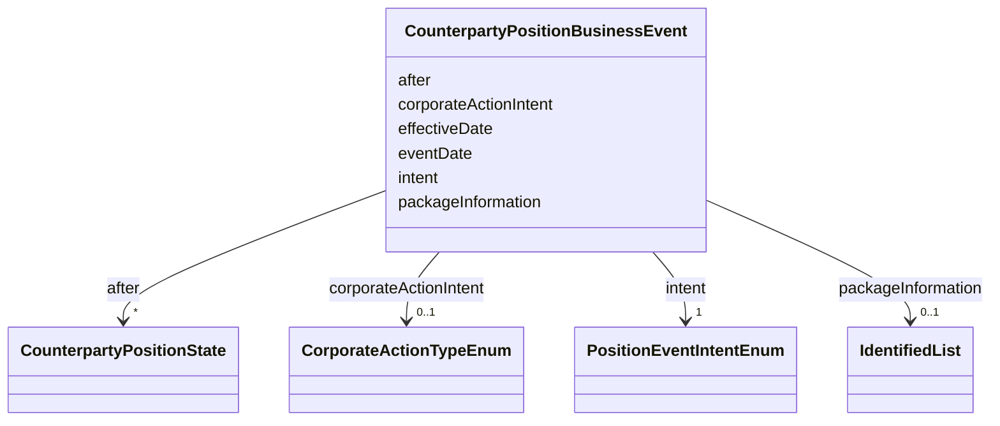

```mermaid
 classDiagram
    class CounterpartyPositionBusinessEvent
    click CounterpartyPositionBusinessEvent href "../CounterpartyPositionBusinessEvent"
      CounterpartyPositionBusinessEvent : after
        
          
    
        
        
        CounterpartyPositionBusinessEvent --> "*" CounterpartyPositionState : after
        click CounterpartyPositionState href "../CounterpartyPositionState"
    

        
      CounterpartyPositionBusinessEvent : corporateActionIntent
        
          
    
        
        
        CounterpartyPositionBusinessEvent --> "0..1" CorporateActionTypeEnum : corporateActionIntent
        click CorporateActionTypeEnum href "../CorporateActionTypeEnum"
    

        
      CounterpartyPositionBusinessEvent : effectiveDate
        
      CounterpartyPositionBusinessEvent : eventDate
        
      CounterpartyPositionBusinessEvent : intent
        
          
    
        
        
        CounterpartyPositionBusinessEvent --> "1" PositionEventIntentEnum : intent
        click PositionEventIntentEnum href "../PositionEventIntentEnum"
    

        
      CounterpartyPositionBusinessEvent : packageInformation
        
          
    
        
        
        CounterpartyPositionBusinessEvent --> "0..1" IdentifiedList : packageInformation
        click IdentifiedList href "../IdentifiedList"
    

        
      
```
