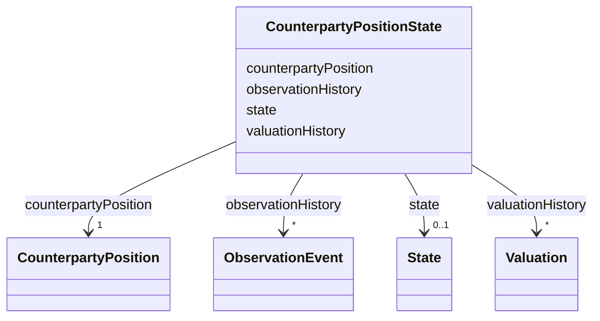

```mermaid
 classDiagram
    class CounterpartyPositionState
    click CounterpartyPositionState href "../CounterpartyPositionState"
      CounterpartyPositionState : counterpartyPosition
        
          
    
        
        
        CounterpartyPositionState --> "1" CounterpartyPosition : counterpartyPosition
        click CounterpartyPosition href "../CounterpartyPosition"
    

        
      CounterpartyPositionState : observationHistory
        
          
    
        
        
        CounterpartyPositionState --> "*" ObservationEvent : observationHistory
        click ObservationEvent href "../ObservationEvent"
    

        
      CounterpartyPositionState : state
        
          
    
        
        
        CounterpartyPositionState --> "0..1" State : state
        click State href "../State"
    

        
      CounterpartyPositionState : valuationHistory
        
          
    
        
        
        CounterpartyPositionState --> "*" Valuation : valuationHistory
        click Valuation href "../Valuation"
    

        
      
```
