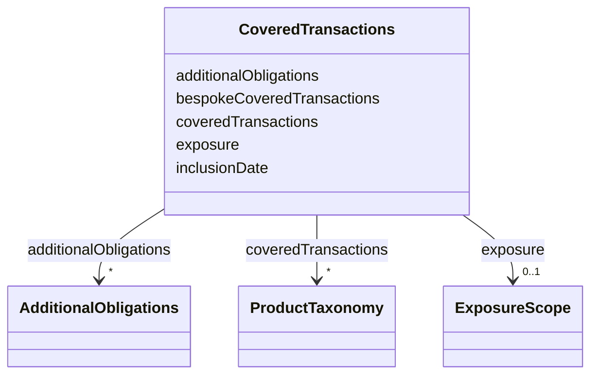

```mermaid
 classDiagram
    class CoveredTransactions
    click CoveredTransactions href "../CoveredTransactions"
      CoveredTransactions : additionalObligations
        
          
    
        
        
        CoveredTransactions --> "*" AdditionalObligations : additionalObligations
        click AdditionalObligations href "../AdditionalObligations"
    

        
      CoveredTransactions : bespokeCoveredTransactions
        
      CoveredTransactions : coveredTransactions
        
          
    
        
        
        CoveredTransactions --> "*" ProductTaxonomy : coveredTransactions
        click ProductTaxonomy href "../ProductTaxonomy"
    

        
      CoveredTransactions : exposure
        
          
    
        
        
        CoveredTransactions --> "0..1" ExposureScope : exposure
        click ExposureScope href "../ExposureScope"
    

        
      CoveredTransactions : inclusionDate
        
      
```
