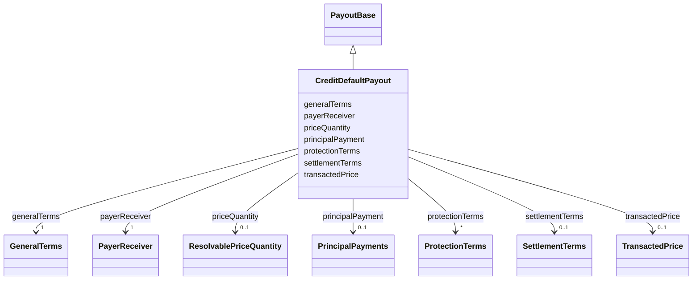

```mermaid
 classDiagram
    class CreditDefaultPayout
    click CreditDefaultPayout href "../CreditDefaultPayout"
      PayoutBase <|-- CreditDefaultPayout
        click PayoutBase href "../PayoutBase"
      
      CreditDefaultPayout : generalTerms
        
          
    
        
        
        CreditDefaultPayout --> "1" GeneralTerms : generalTerms
        click GeneralTerms href "../GeneralTerms"
    

        
      CreditDefaultPayout : payerReceiver
        
          
    
        
        
        CreditDefaultPayout --> "1" PayerReceiver : payerReceiver
        click PayerReceiver href "../PayerReceiver"
    

        
      CreditDefaultPayout : priceQuantity
        
          
    
        
        
        CreditDefaultPayout --> "0..1" ResolvablePriceQuantity : priceQuantity
        click ResolvablePriceQuantity href "../ResolvablePriceQuantity"
    

        
      CreditDefaultPayout : principalPayment
        
          
    
        
        
        CreditDefaultPayout --> "0..1" PrincipalPayments : principalPayment
        click PrincipalPayments href "../PrincipalPayments"
    

        
      CreditDefaultPayout : protectionTerms
        
          
    
        
        
        CreditDefaultPayout --> "*" ProtectionTerms : protectionTerms
        click ProtectionTerms href "../ProtectionTerms"
    

        
      CreditDefaultPayout : settlementTerms
        
          
    
        
        
        CreditDefaultPayout --> "0..1" SettlementTerms : settlementTerms
        click SettlementTerms href "../SettlementTerms"
    

        
      CreditDefaultPayout : transactedPrice
        
          
    
        
        
        CreditDefaultPayout --> "0..1" TransactedPrice : transactedPrice
        click TransactedPrice href "../TransactedPrice"
    

        
      
```
