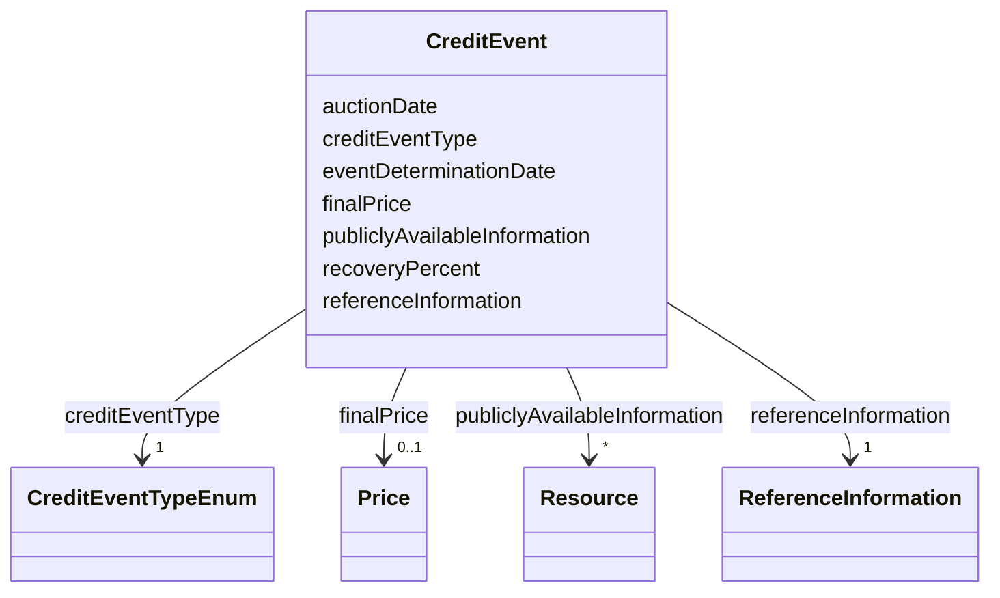

```mermaid
 classDiagram
    class CreditEvent
    click CreditEvent href "../CreditEvent"
      CreditEvent : auctionDate
        
      CreditEvent : creditEventType
        
          
    
        
        
        CreditEvent --> "1" CreditEventTypeEnum : creditEventType
        click CreditEventTypeEnum href "../CreditEventTypeEnum"
    

        
      CreditEvent : eventDeterminationDate
        
      CreditEvent : finalPrice
        
          
    
        
        
        CreditEvent --> "0..1" Price : finalPrice
        click Price href "../Price"
    

        
      CreditEvent : publiclyAvailableInformation
        
          
    
        
        
        CreditEvent --> "*" Resource : publiclyAvailableInformation
        click Resource href "../Resource"
    

        
      CreditEvent : recoveryPercent
        
      CreditEvent : referenceInformation
        
          
    
        
        
        CreditEvent --> "1" ReferenceInformation : referenceInformation
        click ReferenceInformation href "../ReferenceInformation"
    

        
      
```
