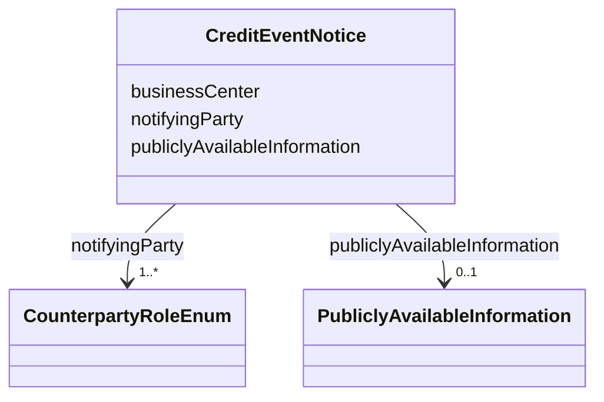

```mermaid
 classDiagram
    class CreditEventNotice
    click CreditEventNotice href "../CreditEventNotice"
      CreditEventNotice : businessCenter
        
      CreditEventNotice : notifyingParty
        
          
    
        
        
        CreditEventNotice --> "1..*" CounterpartyRoleEnum : notifyingParty
        click CounterpartyRoleEnum href "../CounterpartyRoleEnum"
    

        
      CreditEventNotice : publiclyAvailableInformation
        
          
    
        
        
        CreditEventNotice --> "0..1" PubliclyAvailableInformation : publiclyAvailableInformation
        click PubliclyAvailableInformation href "../PubliclyAvailableInformation"
    

        
      
```
