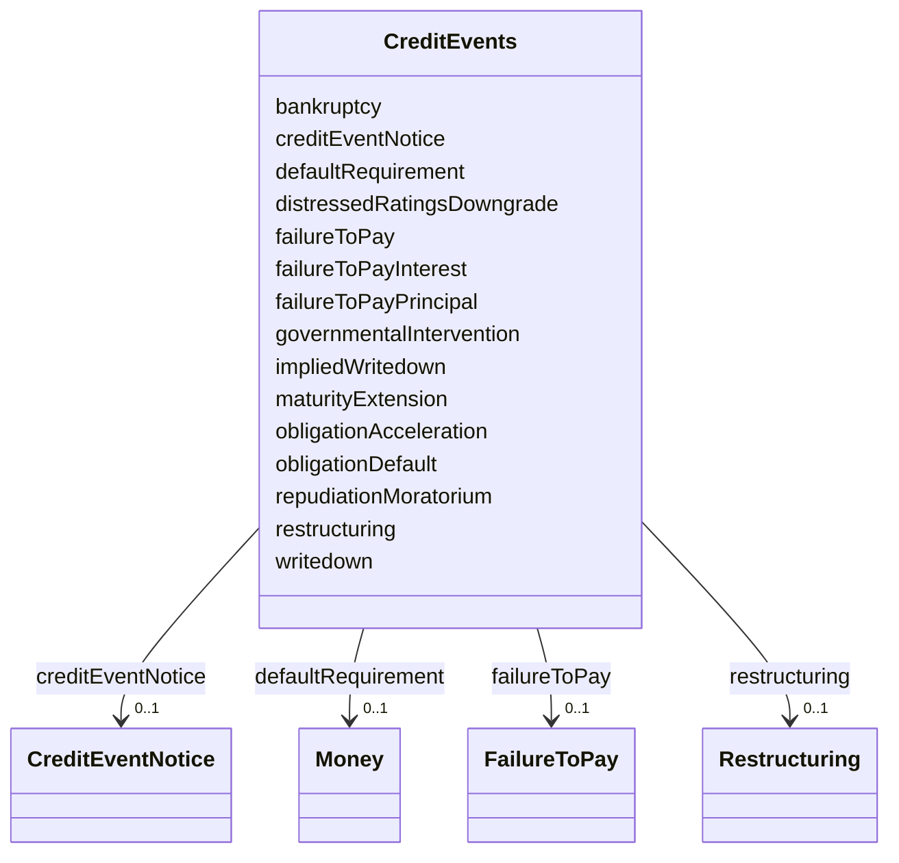

```mermaid
 classDiagram
    class CreditEvents
    click CreditEvents href "../CreditEvents"
      CreditEvents : bankruptcy
        
      CreditEvents : creditEventNotice
        
          
    
        
        
        CreditEvents --> "0..1" CreditEventNotice : creditEventNotice
        click CreditEventNotice href "../CreditEventNotice"
    

        
      CreditEvents : defaultRequirement
        
          
    
        
        
        CreditEvents --> "0..1" Money : defaultRequirement
        click Money href "../Money"
    

        
      CreditEvents : distressedRatingsDowngrade
        
      CreditEvents : failureToPay
        
          
    
        
        
        CreditEvents --> "0..1" FailureToPay : failureToPay
        click FailureToPay href "../FailureToPay"
    

        
      CreditEvents : failureToPayInterest
        
      CreditEvents : failureToPayPrincipal
        
      CreditEvents : governmentalIntervention
        
      CreditEvents : impliedWritedown
        
      CreditEvents : maturityExtension
        
      CreditEvents : obligationAcceleration
        
      CreditEvents : obligationDefault
        
      CreditEvents : repudiationMoratorium
        
      CreditEvents : restructuring
        
          
    
        
        
        CreditEvents --> "0..1" Restructuring : restructuring
        click Restructuring href "../Restructuring"
    

        
      CreditEvents : writedown
        
      
```
