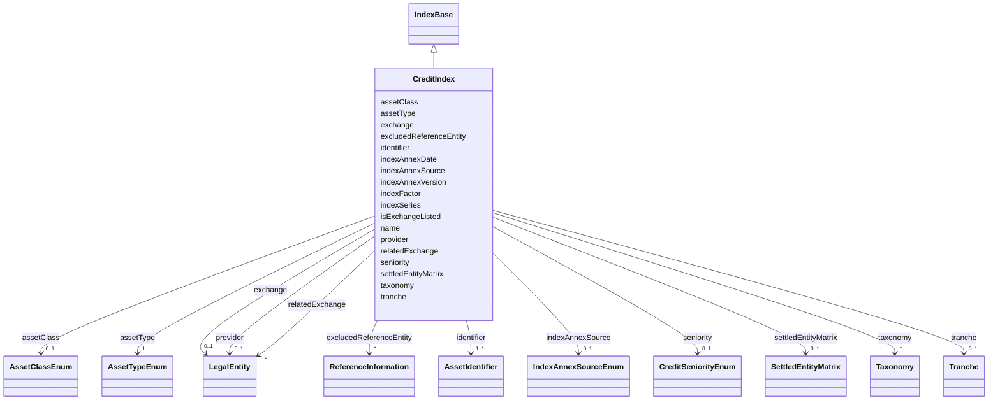

```mermaid
 classDiagram
    class CreditIndex
    click CreditIndex href "../CreditIndex"
      IndexBase <|-- CreditIndex
        click IndexBase href "../IndexBase"
      
      CreditIndex : assetClass
        
          
    
        
        
        CreditIndex --> "0..1" AssetClassEnum : assetClass
        click AssetClassEnum href "../AssetClassEnum"
    

        
      CreditIndex : assetType
        
          
    
        
        
        CreditIndex --> "1" AssetTypeEnum : assetType
        click AssetTypeEnum href "../AssetTypeEnum"
    

        
      CreditIndex : exchange
        
          
    
        
        
        CreditIndex --> "0..1" LegalEntity : exchange
        click LegalEntity href "../LegalEntity"
    

        
      CreditIndex : excludedReferenceEntity
        
          
    
        
        
        CreditIndex --> "*" ReferenceInformation : excludedReferenceEntity
        click ReferenceInformation href "../ReferenceInformation"
    

        
      CreditIndex : identifier
        
          
    
        
        
        CreditIndex --> "1..*" AssetIdentifier : identifier
        click AssetIdentifier href "../AssetIdentifier"
    

        
      CreditIndex : indexAnnexDate
        
      CreditIndex : indexAnnexSource
        
          
    
        
        
        CreditIndex --> "0..1" IndexAnnexSourceEnum : indexAnnexSource
        click IndexAnnexSourceEnum href "../IndexAnnexSourceEnum"
    

        
      CreditIndex : indexAnnexVersion
        
      CreditIndex : indexFactor
        
      CreditIndex : indexSeries
        
      CreditIndex : isExchangeListed
        
      CreditIndex : name
        
      CreditIndex : provider
        
          
    
        
        
        CreditIndex --> "0..1" LegalEntity : provider
        click LegalEntity href "../LegalEntity"
    

        
      CreditIndex : relatedExchange
        
          
    
        
        
        CreditIndex --> "*" LegalEntity : relatedExchange
        click LegalEntity href "../LegalEntity"
    

        
      CreditIndex : seniority
        
          
    
        
        
        CreditIndex --> "0..1" CreditSeniorityEnum : seniority
        click CreditSeniorityEnum href "../CreditSeniorityEnum"
    

        
      CreditIndex : settledEntityMatrix
        
          
    
        
        
        CreditIndex --> "0..1" SettledEntityMatrix : settledEntityMatrix
        click SettledEntityMatrix href "../SettledEntityMatrix"
    

        
      CreditIndex : taxonomy
        
          
    
        
        
        CreditIndex --> "*" Taxonomy : taxonomy
        click Taxonomy href "../Taxonomy"
    

        
      CreditIndex : tranche
        
          
    
        
        
        CreditIndex --> "0..1" Tranche : tranche
        click Tranche href "../Tranche"
    

        
      
```
