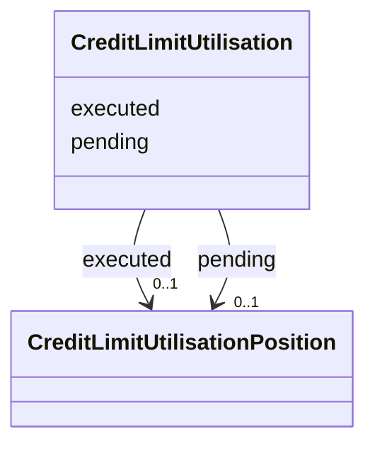

```mermaid
 classDiagram
    class CreditLimitUtilisation
    click CreditLimitUtilisation href "../CreditLimitUtilisation"
      CreditLimitUtilisation : executed
        
          
    
        
        
        CreditLimitUtilisation --> "0..1" CreditLimitUtilisationPosition : executed
        click CreditLimitUtilisationPosition href "../CreditLimitUtilisationPosition"
    

        
      CreditLimitUtilisation : pending
        
          
    
        
        
        CreditLimitUtilisation --> "0..1" CreditLimitUtilisationPosition : pending
        click CreditLimitUtilisationPosition href "../CreditLimitUtilisationPosition"
    

        
      
```
