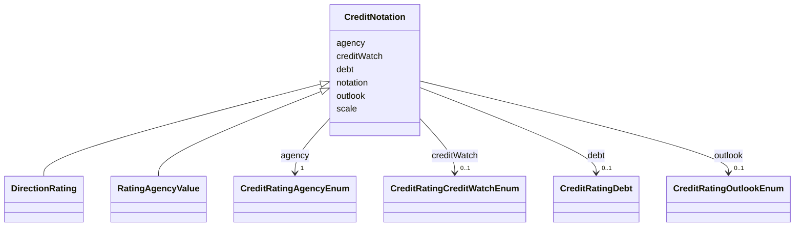

```mermaid
 classDiagram
    class CreditNotation
    click CreditNotation href "../CreditNotation"
      CreditNotation <|-- DirectionRating
        click DirectionRating href "../DirectionRating"
      CreditNotation <|-- RatingAgencyValue
        click RatingAgencyValue href "../RatingAgencyValue"
      
      CreditNotation : agency
        
          
    
        
        
        CreditNotation --> "1" CreditRatingAgencyEnum : agency
        click CreditRatingAgencyEnum href "../CreditRatingAgencyEnum"
    

        
      CreditNotation : creditWatch
        
          
    
        
        
        CreditNotation --> "0..1" CreditRatingCreditWatchEnum : creditWatch
        click CreditRatingCreditWatchEnum href "../CreditRatingCreditWatchEnum"
    

        
      CreditNotation : debt
        
          
    
        
        
        CreditNotation --> "0..1" CreditRatingDebt : debt
        click CreditRatingDebt href "../CreditRatingDebt"
    

        
      CreditNotation : notation
        
      CreditNotation : outlook
        
          
    
        
        
        CreditNotation --> "0..1" CreditRatingOutlookEnum : outlook
        click CreditRatingOutlookEnum href "../CreditRatingOutlookEnum"
    

        
      CreditNotation : scale
        
      
```
