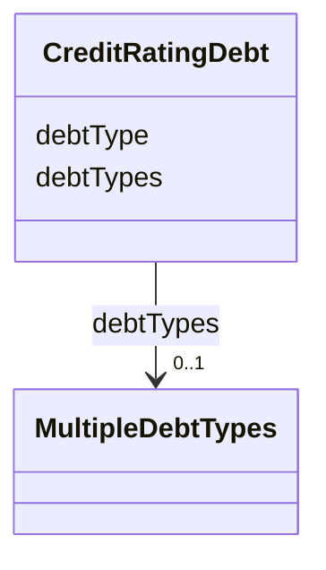

```mermaid
 classDiagram
    class CreditRatingDebt
    click CreditRatingDebt href "../CreditRatingDebt"
      CreditRatingDebt : debtType
        
      CreditRatingDebt : debtTypes
        
          
    
        
        
        CreditRatingDebt --> "0..1" MultipleDebtTypes : debtTypes
        click MultipleDebtTypes href "../MultipleDebtTypes"
    

        
      
```
