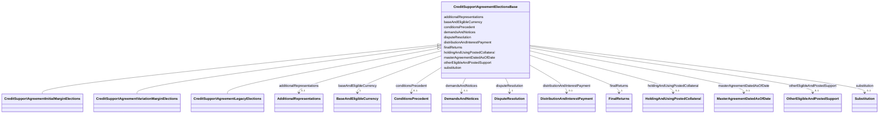

```mermaid
 classDiagram
    class CreditSupportAgreementElectionsBase
    click CreditSupportAgreementElectionsBase href "../CreditSupportAgreementElectionsBase"
      CreditSupportAgreementElectionsBase <|-- CreditSupportAgreementInitialMarginElections
        click CreditSupportAgreementInitialMarginElections href "../CreditSupportAgreementInitialMarginElections"
      CreditSupportAgreementElectionsBase <|-- CreditSupportAgreementVariationMarginElections
        click CreditSupportAgreementVariationMarginElections href "../CreditSupportAgreementVariationMarginElections"
      CreditSupportAgreementElectionsBase <|-- CreditSupportAgreementLegacyElections
        click CreditSupportAgreementLegacyElections href "../CreditSupportAgreementLegacyElections"
      
      CreditSupportAgreementElectionsBase : additionalRepresentations
        
          
    
        
        
        CreditSupportAgreementElectionsBase --> "0..1" AdditionalRepresentations : additionalRepresentations
        click AdditionalRepresentations href "../AdditionalRepresentations"
    

        
      CreditSupportAgreementElectionsBase : baseAndEligibleCurrency
        
          
    
        
        
        CreditSupportAgreementElectionsBase --> "1" BaseAndEligibleCurrency : baseAndEligibleCurrency
        click BaseAndEligibleCurrency href "../BaseAndEligibleCurrency"
    

        
      CreditSupportAgreementElectionsBase : conditionsPrecedent
        
          
    
        
        
        CreditSupportAgreementElectionsBase --> "0..1" ConditionsPrecedent : conditionsPrecedent
        click ConditionsPrecedent href "../ConditionsPrecedent"
    

        
      CreditSupportAgreementElectionsBase : demandsAndNotices
        
          
    
        
        
        CreditSupportAgreementElectionsBase --> "0..1" DemandsAndNotices : demandsAndNotices
        click DemandsAndNotices href "../DemandsAndNotices"
    

        
      CreditSupportAgreementElectionsBase : disputeResolution
        
          
    
        
        
        CreditSupportAgreementElectionsBase --> "1" DisputeResolution : disputeResolution
        click DisputeResolution href "../DisputeResolution"
    

        
      CreditSupportAgreementElectionsBase : distributionAndInterestPayment
        
          
    
        
        
        CreditSupportAgreementElectionsBase --> "0..1" DistributionAndInterestPayment : distributionAndInterestPayment
        click DistributionAndInterestPayment href "../DistributionAndInterestPayment"
    

        
      CreditSupportAgreementElectionsBase : finalReturns
        
          
    
        
        
        CreditSupportAgreementElectionsBase --> "1" FinalReturns : finalReturns
        click FinalReturns href "../FinalReturns"
    

        
      CreditSupportAgreementElectionsBase : holdingAndUsingPostedCollateral
        
          
    
        
        
        CreditSupportAgreementElectionsBase --> "0..1" HoldingAndUsingPostedCollateral : holdingAndUsingPostedCollateral
        click HoldingAndUsingPostedCollateral href "../HoldingAndUsingPostedCollateral"
    

        
      CreditSupportAgreementElectionsBase : masterAgreementDatedAsOfDate
        
          
    
        
        
        CreditSupportAgreementElectionsBase --> "0..1" MasterAgreementDatedAsOfDate : masterAgreementDatedAsOfDate
        click MasterAgreementDatedAsOfDate href "../MasterAgreementDatedAsOfDate"
    

        
      CreditSupportAgreementElectionsBase : otherEligibleAndPostedSupport
        
          
    
        
        
        CreditSupportAgreementElectionsBase --> "0..1" OtherEligibleAndPostedSupport : otherEligibleAndPostedSupport
        click OtherEligibleAndPostedSupport href "../OtherEligibleAndPostedSupport"
    

        
      CreditSupportAgreementElectionsBase : substitution
        
          
    
        
        
        CreditSupportAgreementElectionsBase --> "0..1" Substitution : substitution
        click Substitution href "../Substitution"
    

        
      
```
