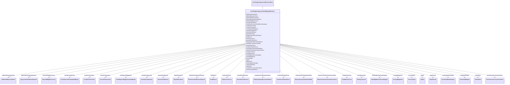

```mermaid
 classDiagram
    class CreditSupportAgreementInitialMarginElections
    click CreditSupportAgreementInitialMarginElections href "../CreditSupportAgreementInitialMarginElections"
      CreditSupportAgreementElectionsBase <|-- CreditSupportAgreementInitialMarginElections
        click CreditSupportAgreementElectionsBase href "../CreditSupportAgreementElectionsBase"
      
      CreditSupportAgreementInitialMarginElections : additionalAmendments
        
      CreditSupportAgreementInitialMarginElections : additionalBespokeTerms
        
      CreditSupportAgreementInitialMarginElections : additionalRepresentations
        
          
    
        
        
        CreditSupportAgreementInitialMarginElections --> "0..1" AdditionalRepresentations : additionalRepresentations
        click AdditionalRepresentations href "../AdditionalRepresentations"
    

        
      CreditSupportAgreementInitialMarginElections : appropriatedCollateralValuation
        
          
    
        
        
        CreditSupportAgreementInitialMarginElections --> "0..1" AppropriatedCollateralValuation : appropriatedCollateralValuation
        click AppropriatedCollateralValuation href "../AppropriatedCollateralValuation"
    

        
      CreditSupportAgreementInitialMarginElections : baseAndEligibleCurrency
        
          
    
        
        
        CreditSupportAgreementInitialMarginElections --> "1" BaseAndEligibleCurrency : baseAndEligibleCurrency
        click BaseAndEligibleCurrency href "../BaseAndEligibleCurrency"
    

        
      CreditSupportAgreementInitialMarginElections : calculationAndTiming
        
          
    
        
        
        CreditSupportAgreementInitialMarginElections --> "1" CalculationAndTimingInitialMargin : calculationAndTiming
        click CalculationAndTimingInitialMargin href "../CalculationAndTimingInitialMargin"
    

        
      CreditSupportAgreementInitialMarginElections : clientAssetSourcebookAdditionalLanguage
        
      CreditSupportAgreementInitialMarginElections : conditionsPrecedent
        
          
    
        
        
        CreditSupportAgreementInitialMarginElections --> "0..1" ConditionsPrecedent : conditionsPrecedent
        click ConditionsPrecedent href "../ConditionsPrecedent"
    

        
      CreditSupportAgreementInitialMarginElections : coveredTransactions
        
          
    
        
        
        CreditSupportAgreementInitialMarginElections --> "0..1" CoveredTransactions : coveredTransactions
        click CoveredTransactions href "../CoveredTransactions"
    

        
      CreditSupportAgreementInitialMarginElections : creditSupportObligations
        
          
    
        
        
        CreditSupportAgreementInitialMarginElections --> "1" CreditSupportObligationsInitialMargin : creditSupportObligations
        click CreditSupportObligationsInitialMargin href "../CreditSupportObligationsInitialMargin"
    

        
      CreditSupportAgreementInitialMarginElections : custodyArrangements
        
          
    
        
        
        CreditSupportAgreementInitialMarginElections --> "0..1" CustodyArrangements : custodyArrangements
        click CustodyArrangements href "../CustodyArrangements"
    

        
      CreditSupportAgreementInitialMarginElections : demandsAndNotices
        
          
    
        
        
        CreditSupportAgreementInitialMarginElections --> "0..1" DemandsAndNotices : demandsAndNotices
        click DemandsAndNotices href "../DemandsAndNotices"
    

        
      CreditSupportAgreementInitialMarginElections : disputeResolution
        
          
    
        
        
        CreditSupportAgreementInitialMarginElections --> "1" DisputeResolution : disputeResolution
        click DisputeResolution href "../DisputeResolution"
    

        
      CreditSupportAgreementInitialMarginElections : distributionAndInterestPayment
        
          
    
        
        
        CreditSupportAgreementInitialMarginElections --> "0..1" DistributionAndInterestPayment : distributionAndInterestPayment
        click DistributionAndInterestPayment href "../DistributionAndInterestPayment"
    

        
      CreditSupportAgreementInitialMarginElections : finalReturns
        
          
    
        
        
        CreditSupportAgreementInitialMarginElections --> "1" FinalReturns : finalReturns
        click FinalReturns href "../FinalReturns"
    

        
      CreditSupportAgreementInitialMarginElections : fxHaircutCurrency
        
          
    
        
        
        CreditSupportAgreementInitialMarginElections --> "0..1" FxHaircutCurrency : fxHaircutCurrency
        click FxHaircutCurrency href "../FxHaircutCurrency"
    

        
      CreditSupportAgreementInitialMarginElections : generalSimmElections
        
          
    
        
        
        CreditSupportAgreementInitialMarginElections --> "0..1" GeneralSimmElections : generalSimmElections
        click GeneralSimmElections href "../GeneralSimmElections"
    

        
      CreditSupportAgreementInitialMarginElections : holdingAndUsingPostedCollateral
        
          
    
        
        
        CreditSupportAgreementInitialMarginElections --> "0..1" HoldingAndUsingPostedCollateral : holdingAndUsingPostedCollateral
        click HoldingAndUsingPostedCollateral href "../HoldingAndUsingPostedCollateral"
    

        
      CreditSupportAgreementInitialMarginElections : identifiedCrossCurrencySwap
        
      CreditSupportAgreementInitialMarginElections : interpretationTerms
        
      CreditSupportAgreementInitialMarginElections : jurisdictionRelatedTerms
        
          
    
        
        
        CreditSupportAgreementInitialMarginElections --> "0..1" JurisdictionRelatedTerms : jurisdictionRelatedTerms
        click JurisdictionRelatedTerms href "../JurisdictionRelatedTerms"
    

        
      CreditSupportAgreementInitialMarginElections : masterAgreementDatedAsOfDate
        
          
    
        
        
        CreditSupportAgreementInitialMarginElections --> "0..1" MasterAgreementDatedAsOfDate : masterAgreementDatedAsOfDate
        click MasterAgreementDatedAsOfDate href "../MasterAgreementDatedAsOfDate"
    

        
      CreditSupportAgreementInitialMarginElections : minimumTransferAmountAmendment
        
          
    
        
        
        CreditSupportAgreementInitialMarginElections --> "1" MinimumTransferAmountAmendment : minimumTransferAmountAmendment
        click MinimumTransferAmountAmendment href "../MinimumTransferAmountAmendment"
    

        
      CreditSupportAgreementInitialMarginElections : oneWayProvisions
        
          
    
        
        
        CreditSupportAgreementInitialMarginElections --> "1" OneWayProvisions : oneWayProvisions
        click OneWayProvisions href "../OneWayProvisions"
    

        
      CreditSupportAgreementInitialMarginElections : otherAgreements
        
          
    
        
        
        CreditSupportAgreementInitialMarginElections --> "0..1" OtherAgreements : otherAgreements
        click OtherAgreements href "../OtherAgreements"
    

        
      CreditSupportAgreementInitialMarginElections : otherEligibleAndPostedSupport
        
          
    
        
        
        CreditSupportAgreementInitialMarginElections --> "0..1" OtherEligibleAndPostedSupport : otherEligibleAndPostedSupport
        click OtherEligibleAndPostedSupport href "../OtherEligibleAndPostedSupport"
    

        
      CreditSupportAgreementInitialMarginElections : postingObligations
        
          
    
        
        
        CreditSupportAgreementInitialMarginElections --> "1" PostingObligations : postingObligations
        click PostingObligations href "../PostingObligations"
    

        
      CreditSupportAgreementInitialMarginElections : processAgent
        
          
    
        
        
        CreditSupportAgreementInitialMarginElections --> "1" ProcessAgent : processAgent
        click ProcessAgent href "../ProcessAgent"
    

        
      CreditSupportAgreementInitialMarginElections : regime
        
          
    
        
        
        CreditSupportAgreementInitialMarginElections --> "1" Regime : regime
        click Regime href "../Regime"
    

        
      CreditSupportAgreementInitialMarginElections : rightsEvents
        
          
    
        
        
        CreditSupportAgreementInitialMarginElections --> "1" RightsEvents : rightsEvents
        click RightsEvents href "../RightsEvents"
    

        
      CreditSupportAgreementInitialMarginElections : sensitivityMethodologies
        
          
    
        
        
        CreditSupportAgreementInitialMarginElections --> "1" SensitivityMethodologies : sensitivityMethodologies
        click SensitivityMethodologies href "../SensitivityMethodologies"
    

        
      CreditSupportAgreementInitialMarginElections : substitutedRegime
        
          
    
        
        
        CreditSupportAgreementInitialMarginElections --> "*" SubstitutedRegime : substitutedRegime
        click SubstitutedRegime href "../SubstitutedRegime"
    

        
      CreditSupportAgreementInitialMarginElections : substitution
        
          
    
        
        
        CreditSupportAgreementInitialMarginElections --> "0..1" Substitution : substitution
        click Substitution href "../Substitution"
    

        
      CreditSupportAgreementInitialMarginElections : terminationCurrencyAmendment
        
          
    
        
        
        CreditSupportAgreementInitialMarginElections --> "1" TerminationCurrencyAmendment : terminationCurrencyAmendment
        click TerminationCurrencyAmendment href "../TerminationCurrencyAmendment"
    

        
      CreditSupportAgreementInitialMarginElections : trustSchemeAddendum
        
      
```
