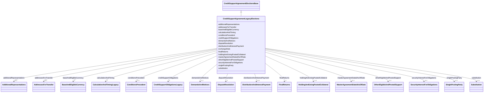

```mermaid
 classDiagram
    class CreditSupportAgreementLegacyElections
    click CreditSupportAgreementLegacyElections href "../CreditSupportAgreementLegacyElections"
      CreditSupportAgreementElectionsBase <|-- CreditSupportAgreementLegacyElections
        click CreditSupportAgreementElectionsBase href "../CreditSupportAgreementElectionsBase"
      
      CreditSupportAgreementLegacyElections : additionalRepresentations
        
          
    
        
        
        CreditSupportAgreementLegacyElections --> "0..1" AdditionalRepresentations : additionalRepresentations
        click AdditionalRepresentations href "../AdditionalRepresentations"
    

        
      CreditSupportAgreementLegacyElections : addressesForTransfer
        
          
    
        
        
        CreditSupportAgreementLegacyElections --> "0..1" AddressesForTransfer : addressesForTransfer
        click AddressesForTransfer href "../AddressesForTransfer"
    

        
      CreditSupportAgreementLegacyElections : baseAndEligibleCurrency
        
          
    
        
        
        CreditSupportAgreementLegacyElections --> "1" BaseAndEligibleCurrency : baseAndEligibleCurrency
        click BaseAndEligibleCurrency href "../BaseAndEligibleCurrency"
    

        
      CreditSupportAgreementLegacyElections : calculationAndTiming
        
          
    
        
        
        CreditSupportAgreementLegacyElections --> "1" CalculationAndTimingLegacy : calculationAndTiming
        click CalculationAndTimingLegacy href "../CalculationAndTimingLegacy"
    

        
      CreditSupportAgreementLegacyElections : conditionsPrecedent
        
          
    
        
        
        CreditSupportAgreementLegacyElections --> "0..1" ConditionsPrecedent : conditionsPrecedent
        click ConditionsPrecedent href "../ConditionsPrecedent"
    

        
      CreditSupportAgreementLegacyElections : creditSupportObligations
        
          
    
        
        
        CreditSupportAgreementLegacyElections --> "1" CreditSupportObligationsLegacy : creditSupportObligations
        click CreditSupportObligationsLegacy href "../CreditSupportObligationsLegacy"
    

        
      CreditSupportAgreementLegacyElections : demandsAndNotices
        
          
    
        
        
        CreditSupportAgreementLegacyElections --> "0..1" DemandsAndNotices : demandsAndNotices
        click DemandsAndNotices href "../DemandsAndNotices"
    

        
      CreditSupportAgreementLegacyElections : disputeResolution
        
          
    
        
        
        CreditSupportAgreementLegacyElections --> "1" DisputeResolution : disputeResolution
        click DisputeResolution href "../DisputeResolution"
    

        
      CreditSupportAgreementLegacyElections : distributionAndInterestPayment
        
          
    
        
        
        CreditSupportAgreementLegacyElections --> "0..1" DistributionAndInterestPayment : distributionAndInterestPayment
        click DistributionAndInterestPayment href "../DistributionAndInterestPayment"
    

        
      CreditSupportAgreementLegacyElections : exchangeDate
        
      CreditSupportAgreementLegacyElections : finalReturns
        
          
    
        
        
        CreditSupportAgreementLegacyElections --> "1" FinalReturns : finalReturns
        click FinalReturns href "../FinalReturns"
    

        
      CreditSupportAgreementLegacyElections : holdingAndUsingPostedCollateral
        
          
    
        
        
        CreditSupportAgreementLegacyElections --> "0..1" HoldingAndUsingPostedCollateral : holdingAndUsingPostedCollateral
        click HoldingAndUsingPostedCollateral href "../HoldingAndUsingPostedCollateral"
    

        
      CreditSupportAgreementLegacyElections : masterAgreementDatedAsOfDate
        
          
    
        
        
        CreditSupportAgreementLegacyElections --> "0..1" MasterAgreementDatedAsOfDate : masterAgreementDatedAsOfDate
        click MasterAgreementDatedAsOfDate href "../MasterAgreementDatedAsOfDate"
    

        
      CreditSupportAgreementLegacyElections : otherEligibleAndPostedSupport
        
          
    
        
        
        CreditSupportAgreementLegacyElections --> "0..1" OtherEligibleAndPostedSupport : otherEligibleAndPostedSupport
        click OtherEligibleAndPostedSupport href "../OtherEligibleAndPostedSupport"
    

        
      CreditSupportAgreementLegacyElections : securityInterestForObligations
        
          
    
        
        
        CreditSupportAgreementLegacyElections --> "0..1" SecurityInterestForObligations : securityInterestForObligations
        click SecurityInterestForObligations href "../SecurityInterestForObligations"
    

        
      CreditSupportAgreementLegacyElections : singlePostingParty
        
          
    
        
        
        CreditSupportAgreementLegacyElections --> "0..1" SinglePostingParty : singlePostingParty
        click SinglePostingParty href "../SinglePostingParty"
    

        
      CreditSupportAgreementLegacyElections : substitution
        
          
    
        
        
        CreditSupportAgreementLegacyElections --> "0..1" Substitution : substitution
        click Substitution href "../Substitution"
    

        
      
```
