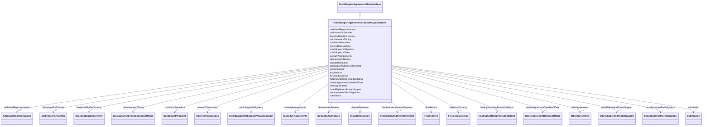

```mermaid
 classDiagram
    class CreditSupportAgreementVariationMarginElections
    click CreditSupportAgreementVariationMarginElections href "../CreditSupportAgreementVariationMarginElections"
      CreditSupportAgreementElectionsBase <|-- CreditSupportAgreementVariationMarginElections
        click CreditSupportAgreementElectionsBase href "../CreditSupportAgreementElectionsBase"
      
      CreditSupportAgreementVariationMarginElections : additionalRepresentations
        
          
    
        
        
        CreditSupportAgreementVariationMarginElections --> "0..1" AdditionalRepresentations : additionalRepresentations
        click AdditionalRepresentations href "../AdditionalRepresentations"
    

        
      CreditSupportAgreementVariationMarginElections : addressesForTransfer
        
          
    
        
        
        CreditSupportAgreementVariationMarginElections --> "0..1" AddressesForTransfer : addressesForTransfer
        click AddressesForTransfer href "../AddressesForTransfer"
    

        
      CreditSupportAgreementVariationMarginElections : baseAndEligibleCurrency
        
          
    
        
        
        CreditSupportAgreementVariationMarginElections --> "1" BaseAndEligibleCurrency : baseAndEligibleCurrency
        click BaseAndEligibleCurrency href "../BaseAndEligibleCurrency"
    

        
      CreditSupportAgreementVariationMarginElections : calculationAndTiming
        
          
    
        
        
        CreditSupportAgreementVariationMarginElections --> "1" CalculationAndTimingVariationMargin : calculationAndTiming
        click CalculationAndTimingVariationMargin href "../CalculationAndTimingVariationMargin"
    

        
      CreditSupportAgreementVariationMarginElections : conditionsPrecedent
        
          
    
        
        
        CreditSupportAgreementVariationMarginElections --> "0..1" ConditionsPrecedent : conditionsPrecedent
        click ConditionsPrecedent href "../ConditionsPrecedent"
    

        
      CreditSupportAgreementVariationMarginElections : coveredTransactions
        
          
    
        
        
        CreditSupportAgreementVariationMarginElections --> "1" CoveredTransactions : coveredTransactions
        click CoveredTransactions href "../CoveredTransactions"
    

        
      CreditSupportAgreementVariationMarginElections : creditSupportObligations
        
          
    
        
        
        CreditSupportAgreementVariationMarginElections --> "1" CreditSupportObligationsVariationMargin : creditSupportObligations
        click CreditSupportObligationsVariationMargin href "../CreditSupportObligationsVariationMargin"
    

        
      CreditSupportAgreementVariationMarginElections : creditSupportOffsets
        
      CreditSupportAgreementVariationMarginElections : custodyArrangements
        
          
    
        
        
        CreditSupportAgreementVariationMarginElections --> "0..1" CustodyArrangements : custodyArrangements
        click CustodyArrangements href "../CustodyArrangements"
    

        
      CreditSupportAgreementVariationMarginElections : demandsAndNotices
        
          
    
        
        
        CreditSupportAgreementVariationMarginElections --> "0..1" DemandsAndNotices : demandsAndNotices
        click DemandsAndNotices href "../DemandsAndNotices"
    

        
      CreditSupportAgreementVariationMarginElections : disputeResolution
        
          
    
        
        
        CreditSupportAgreementVariationMarginElections --> "1" DisputeResolution : disputeResolution
        click DisputeResolution href "../DisputeResolution"
    

        
      CreditSupportAgreementVariationMarginElections : distributionAndInterestPayment
        
          
    
        
        
        CreditSupportAgreementVariationMarginElections --> "0..1" DistributionAndInterestPayment : distributionAndInterestPayment
        click DistributionAndInterestPayment href "../DistributionAndInterestPayment"
    

        
      CreditSupportAgreementVariationMarginElections : exchangeDate
        
      CreditSupportAgreementVariationMarginElections : finalReturns
        
          
    
        
        
        CreditSupportAgreementVariationMarginElections --> "1" FinalReturns : finalReturns
        click FinalReturns href "../FinalReturns"
    

        
      CreditSupportAgreementVariationMarginElections : fxHaircutCurrency
        
          
    
        
        
        CreditSupportAgreementVariationMarginElections --> "0..1" FxHaircutCurrency : fxHaircutCurrency
        click FxHaircutCurrency href "../FxHaircutCurrency"
    

        
      CreditSupportAgreementVariationMarginElections : holdingAndUsingPostedCollateral
        
          
    
        
        
        CreditSupportAgreementVariationMarginElections --> "0..1" HoldingAndUsingPostedCollateral : holdingAndUsingPostedCollateral
        click HoldingAndUsingPostedCollateral href "../HoldingAndUsingPostedCollateral"
    

        
      CreditSupportAgreementVariationMarginElections : masterAgreementDatedAsOfDate
        
          
    
        
        
        CreditSupportAgreementVariationMarginElections --> "0..1" MasterAgreementDatedAsOfDate : masterAgreementDatedAsOfDate
        click MasterAgreementDatedAsOfDate href "../MasterAgreementDatedAsOfDate"
    

        
      CreditSupportAgreementVariationMarginElections : otherAgreements
        
          
    
        
        
        CreditSupportAgreementVariationMarginElections --> "0..1" OtherAgreements : otherAgreements
        click OtherAgreements href "../OtherAgreements"
    

        
      CreditSupportAgreementVariationMarginElections : otherEligibleAndPostedSupport
        
          
    
        
        
        CreditSupportAgreementVariationMarginElections --> "0..1" OtherEligibleAndPostedSupport : otherEligibleAndPostedSupport
        click OtherEligibleAndPostedSupport href "../OtherEligibleAndPostedSupport"
    

        
      CreditSupportAgreementVariationMarginElections : securityInterestForObligations
        
          
    
        
        
        CreditSupportAgreementVariationMarginElections --> "1" SecurityInterestForObligations : securityInterestForObligations
        click SecurityInterestForObligations href "../SecurityInterestForObligations"
    

        
      CreditSupportAgreementVariationMarginElections : substitution
        
          
    
        
        
        CreditSupportAgreementVariationMarginElections --> "0..1" Substitution : substitution
        click Substitution href "../Substitution"
    

        
      
```
