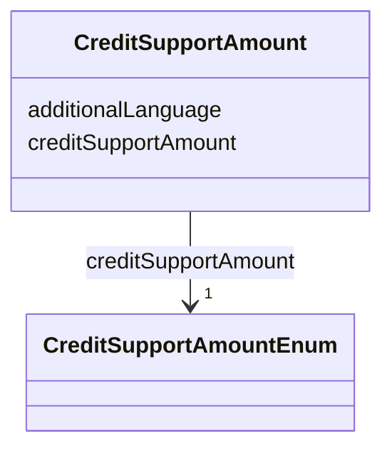

```mermaid
 classDiagram
    class CreditSupportAmount
    click CreditSupportAmount href "../CreditSupportAmount"
      CreditSupportAmount : additionalLanguage
        
      CreditSupportAmount : creditSupportAmount
        
          
    
        
        
        CreditSupportAmount --> "1" CreditSupportAmountEnum : creditSupportAmount
        click CreditSupportAmountEnum href "../CreditSupportAmountEnum"
    

        
      
```
