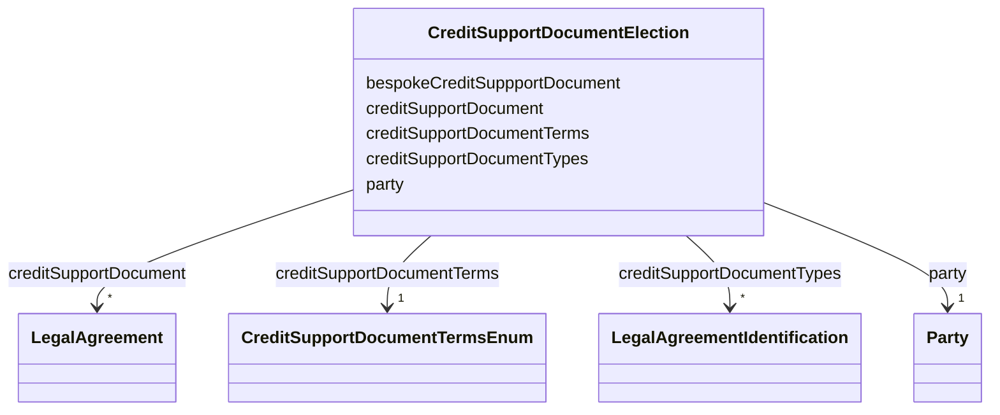

```mermaid
 classDiagram
    class CreditSupportDocumentElection
    click CreditSupportDocumentElection href "../CreditSupportDocumentElection"
      CreditSupportDocumentElection : bespokeCreditSuppportDocument
        
      CreditSupportDocumentElection : creditSupportDocument
        
          
    
        
        
        CreditSupportDocumentElection --> "*" LegalAgreement : creditSupportDocument
        click LegalAgreement href "../LegalAgreement"
    

        
      CreditSupportDocumentElection : creditSupportDocumentTerms
        
          
    
        
        
        CreditSupportDocumentElection --> "1" CreditSupportDocumentTermsEnum : creditSupportDocumentTerms
        click CreditSupportDocumentTermsEnum href "../CreditSupportDocumentTermsEnum"
    

        
      CreditSupportDocumentElection : creditSupportDocumentTypes
        
          
    
        
        
        CreditSupportDocumentElection --> "*" LegalAgreementIdentification : creditSupportDocumentTypes
        click LegalAgreementIdentification href "../LegalAgreementIdentification"
    

        
      CreditSupportDocumentElection : party
        
          
    
        
        
        CreditSupportDocumentElection --> "1" Party : party
        click Party href "../Party"
    

        
      
```
