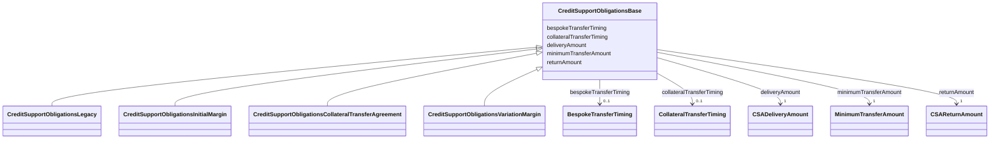

```mermaid
 classDiagram
    class CreditSupportObligationsBase
    click CreditSupportObligationsBase href "../CreditSupportObligationsBase"
      CreditSupportObligationsBase <|-- CreditSupportObligationsLegacy
        click CreditSupportObligationsLegacy href "../CreditSupportObligationsLegacy"
      CreditSupportObligationsBase <|-- CreditSupportObligationsInitialMargin
        click CreditSupportObligationsInitialMargin href "../CreditSupportObligationsInitialMargin"
      CreditSupportObligationsBase <|-- CreditSupportObligationsCollateralTransferAgreement
        click CreditSupportObligationsCollateralTransferAgreement href "../CreditSupportObligationsCollateralTransferAgreement"
      CreditSupportObligationsBase <|-- CreditSupportObligationsVariationMargin
        click CreditSupportObligationsVariationMargin href "../CreditSupportObligationsVariationMargin"
      
      CreditSupportObligationsBase : bespokeTransferTiming
        
          
    
        
        
        CreditSupportObligationsBase --> "0..1" BespokeTransferTiming : bespokeTransferTiming
        click BespokeTransferTiming href "../BespokeTransferTiming"
    

        
      CreditSupportObligationsBase : collateralTransferTiming
        
          
    
        
        
        CreditSupportObligationsBase --> "0..1" CollateralTransferTiming : collateralTransferTiming
        click CollateralTransferTiming href "../CollateralTransferTiming"
    

        
      CreditSupportObligationsBase : deliveryAmount
        
          
    
        
        
        CreditSupportObligationsBase --> "1" CSADeliveryAmount : deliveryAmount
        click CSADeliveryAmount href "../CSADeliveryAmount"
    

        
      CreditSupportObligationsBase : minimumTransferAmount
        
          
    
        
        
        CreditSupportObligationsBase --> "1" MinimumTransferAmount : minimumTransferAmount
        click MinimumTransferAmount href "../MinimumTransferAmount"
    

        
      CreditSupportObligationsBase : returnAmount
        
          
    
        
        
        CreditSupportObligationsBase --> "1" CSAReturnAmount : returnAmount
        click CSAReturnAmount href "../CSAReturnAmount"
    

        
      
```
