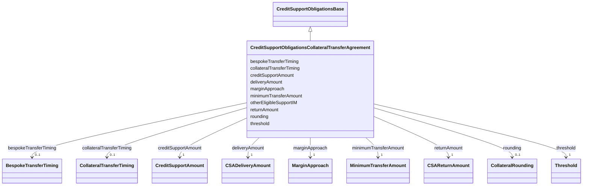

```mermaid
 classDiagram
    class CreditSupportObligationsCollateralTransferAgreement
    click CreditSupportObligationsCollateralTransferAgreement href "../CreditSupportObligationsCollateralTransferAgreement"
      CreditSupportObligationsBase <|-- CreditSupportObligationsCollateralTransferAgreement
        click CreditSupportObligationsBase href "../CreditSupportObligationsBase"
      
      CreditSupportObligationsCollateralTransferAgreement : bespokeTransferTiming
        
          
    
        
        
        CreditSupportObligationsCollateralTransferAgreement --> "0..1" BespokeTransferTiming : bespokeTransferTiming
        click BespokeTransferTiming href "../BespokeTransferTiming"
    

        
      CreditSupportObligationsCollateralTransferAgreement : collateralTransferTiming
        
          
    
        
        
        CreditSupportObligationsCollateralTransferAgreement --> "0..1" CollateralTransferTiming : collateralTransferTiming
        click CollateralTransferTiming href "../CollateralTransferTiming"
    

        
      CreditSupportObligationsCollateralTransferAgreement : creditSupportAmount
        
          
    
        
        
        CreditSupportObligationsCollateralTransferAgreement --> "1" CreditSupportAmount : creditSupportAmount
        click CreditSupportAmount href "../CreditSupportAmount"
    

        
      CreditSupportObligationsCollateralTransferAgreement : deliveryAmount
        
          
    
        
        
        CreditSupportObligationsCollateralTransferAgreement --> "1" CSADeliveryAmount : deliveryAmount
        click CSADeliveryAmount href "../CSADeliveryAmount"
    

        
      CreditSupportObligationsCollateralTransferAgreement : marginApproach
        
          
    
        
        
        CreditSupportObligationsCollateralTransferAgreement --> "1" MarginApproach : marginApproach
        click MarginApproach href "../MarginApproach"
    

        
      CreditSupportObligationsCollateralTransferAgreement : minimumTransferAmount
        
          
    
        
        
        CreditSupportObligationsCollateralTransferAgreement --> "1" MinimumTransferAmount : minimumTransferAmount
        click MinimumTransferAmount href "../MinimumTransferAmount"
    

        
      CreditSupportObligationsCollateralTransferAgreement : otherEligibleSupportIM
        
      CreditSupportObligationsCollateralTransferAgreement : returnAmount
        
          
    
        
        
        CreditSupportObligationsCollateralTransferAgreement --> "1" CSAReturnAmount : returnAmount
        click CSAReturnAmount href "../CSAReturnAmount"
    

        
      CreditSupportObligationsCollateralTransferAgreement : rounding
        
          
    
        
        
        CreditSupportObligationsCollateralTransferAgreement --> "0..1" CollateralRounding : rounding
        click CollateralRounding href "../CollateralRounding"
    

        
      CreditSupportObligationsCollateralTransferAgreement : threshold
        
          
    
        
        
        CreditSupportObligationsCollateralTransferAgreement --> "1" Threshold : threshold
        click Threshold href "../Threshold"
    

        
      
```
