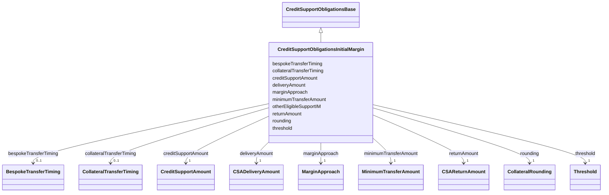

```mermaid
 classDiagram
    class CreditSupportObligationsInitialMargin
    click CreditSupportObligationsInitialMargin href "../CreditSupportObligationsInitialMargin"
      CreditSupportObligationsBase <|-- CreditSupportObligationsInitialMargin
        click CreditSupportObligationsBase href "../CreditSupportObligationsBase"
      
      CreditSupportObligationsInitialMargin : bespokeTransferTiming
        
          
    
        
        
        CreditSupportObligationsInitialMargin --> "0..1" BespokeTransferTiming : bespokeTransferTiming
        click BespokeTransferTiming href "../BespokeTransferTiming"
    

        
      CreditSupportObligationsInitialMargin : collateralTransferTiming
        
          
    
        
        
        CreditSupportObligationsInitialMargin --> "0..1" CollateralTransferTiming : collateralTransferTiming
        click CollateralTransferTiming href "../CollateralTransferTiming"
    

        
      CreditSupportObligationsInitialMargin : creditSupportAmount
        
          
    
        
        
        CreditSupportObligationsInitialMargin --> "1" CreditSupportAmount : creditSupportAmount
        click CreditSupportAmount href "../CreditSupportAmount"
    

        
      CreditSupportObligationsInitialMargin : deliveryAmount
        
          
    
        
        
        CreditSupportObligationsInitialMargin --> "1" CSADeliveryAmount : deliveryAmount
        click CSADeliveryAmount href "../CSADeliveryAmount"
    

        
      CreditSupportObligationsInitialMargin : marginApproach
        
          
    
        
        
        CreditSupportObligationsInitialMargin --> "1" MarginApproach : marginApproach
        click MarginApproach href "../MarginApproach"
    

        
      CreditSupportObligationsInitialMargin : minimumTransferAmount
        
          
    
        
        
        CreditSupportObligationsInitialMargin --> "1" MinimumTransferAmount : minimumTransferAmount
        click MinimumTransferAmount href "../MinimumTransferAmount"
    

        
      CreditSupportObligationsInitialMargin : otherEligibleSupportIM
        
      CreditSupportObligationsInitialMargin : returnAmount
        
          
    
        
        
        CreditSupportObligationsInitialMargin --> "1" CSAReturnAmount : returnAmount
        click CSAReturnAmount href "../CSAReturnAmount"
    

        
      CreditSupportObligationsInitialMargin : rounding
        
          
    
        
        
        CreditSupportObligationsInitialMargin --> "1" CollateralRounding : rounding
        click CollateralRounding href "../CollateralRounding"
    

        
      CreditSupportObligationsInitialMargin : threshold
        
          
    
        
        
        CreditSupportObligationsInitialMargin --> "1" Threshold : threshold
        click Threshold href "../Threshold"
    

        
      
```
