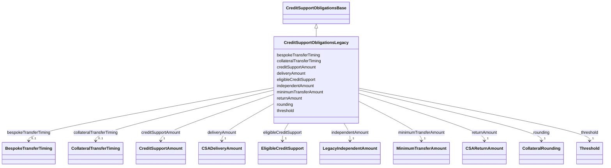

```mermaid
 classDiagram
    class CreditSupportObligationsLegacy
    click CreditSupportObligationsLegacy href "../CreditSupportObligationsLegacy"
      CreditSupportObligationsBase <|-- CreditSupportObligationsLegacy
        click CreditSupportObligationsBase href "../CreditSupportObligationsBase"
      
      CreditSupportObligationsLegacy : bespokeTransferTiming
        
          
    
        
        
        CreditSupportObligationsLegacy --> "0..1" BespokeTransferTiming : bespokeTransferTiming
        click BespokeTransferTiming href "../BespokeTransferTiming"
    

        
      CreditSupportObligationsLegacy : collateralTransferTiming
        
          
    
        
        
        CreditSupportObligationsLegacy --> "0..1" CollateralTransferTiming : collateralTransferTiming
        click CollateralTransferTiming href "../CollateralTransferTiming"
    

        
      CreditSupportObligationsLegacy : creditSupportAmount
        
          
    
        
        
        CreditSupportObligationsLegacy --> "1" CreditSupportAmount : creditSupportAmount
        click CreditSupportAmount href "../CreditSupportAmount"
    

        
      CreditSupportObligationsLegacy : deliveryAmount
        
          
    
        
        
        CreditSupportObligationsLegacy --> "1" CSADeliveryAmount : deliveryAmount
        click CSADeliveryAmount href "../CSADeliveryAmount"
    

        
      CreditSupportObligationsLegacy : eligibleCreditSupport
        
          
    
        
        
        CreditSupportObligationsLegacy --> "1" EligibleCreditSupport : eligibleCreditSupport
        click EligibleCreditSupport href "../EligibleCreditSupport"
    

        
      CreditSupportObligationsLegacy : independentAmount
        
          
    
        
        
        CreditSupportObligationsLegacy --> "1" LegacyIndependentAmount : independentAmount
        click LegacyIndependentAmount href "../LegacyIndependentAmount"
    

        
      CreditSupportObligationsLegacy : minimumTransferAmount
        
          
    
        
        
        CreditSupportObligationsLegacy --> "1" MinimumTransferAmount : minimumTransferAmount
        click MinimumTransferAmount href "../MinimumTransferAmount"
    

        
      CreditSupportObligationsLegacy : returnAmount
        
          
    
        
        
        CreditSupportObligationsLegacy --> "1" CSAReturnAmount : returnAmount
        click CSAReturnAmount href "../CSAReturnAmount"
    

        
      CreditSupportObligationsLegacy : rounding
        
          
    
        
        
        CreditSupportObligationsLegacy --> "1" CollateralRounding : rounding
        click CollateralRounding href "../CollateralRounding"
    

        
      CreditSupportObligationsLegacy : threshold
        
          
    
        
        
        CreditSupportObligationsLegacy --> "1" Threshold : threshold
        click Threshold href "../Threshold"
    

        
      
```
