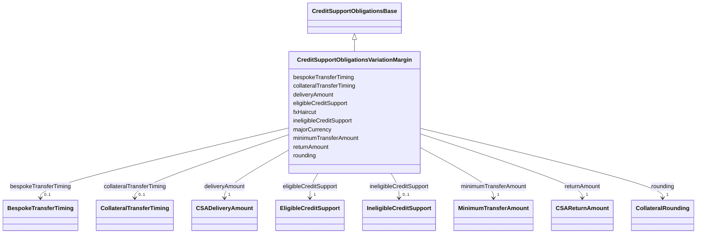

```mermaid
 classDiagram
    class CreditSupportObligationsVariationMargin
    click CreditSupportObligationsVariationMargin href "../CreditSupportObligationsVariationMargin"
      CreditSupportObligationsBase <|-- CreditSupportObligationsVariationMargin
        click CreditSupportObligationsBase href "../CreditSupportObligationsBase"
      
      CreditSupportObligationsVariationMargin : bespokeTransferTiming
        
          
    
        
        
        CreditSupportObligationsVariationMargin --> "0..1" BespokeTransferTiming : bespokeTransferTiming
        click BespokeTransferTiming href "../BespokeTransferTiming"
    

        
      CreditSupportObligationsVariationMargin : collateralTransferTiming
        
          
    
        
        
        CreditSupportObligationsVariationMargin --> "0..1" CollateralTransferTiming : collateralTransferTiming
        click CollateralTransferTiming href "../CollateralTransferTiming"
    

        
      CreditSupportObligationsVariationMargin : deliveryAmount
        
          
    
        
        
        CreditSupportObligationsVariationMargin --> "1" CSADeliveryAmount : deliveryAmount
        click CSADeliveryAmount href "../CSADeliveryAmount"
    

        
      CreditSupportObligationsVariationMargin : eligibleCreditSupport
        
          
    
        
        
        CreditSupportObligationsVariationMargin --> "1" EligibleCreditSupport : eligibleCreditSupport
        click EligibleCreditSupport href "../EligibleCreditSupport"
    

        
      CreditSupportObligationsVariationMargin : fxHaircut
        
      CreditSupportObligationsVariationMargin : ineligibleCreditSupport
        
          
    
        
        
        CreditSupportObligationsVariationMargin --> "0..1" IneligibleCreditSupport : ineligibleCreditSupport
        click IneligibleCreditSupport href "../IneligibleCreditSupport"
    

        
      CreditSupportObligationsVariationMargin : majorCurrency
        
      CreditSupportObligationsVariationMargin : minimumTransferAmount
        
          
    
        
        
        CreditSupportObligationsVariationMargin --> "1" MinimumTransferAmount : minimumTransferAmount
        click MinimumTransferAmount href "../MinimumTransferAmount"
    

        
      CreditSupportObligationsVariationMargin : returnAmount
        
          
    
        
        
        CreditSupportObligationsVariationMargin --> "1" CSAReturnAmount : returnAmount
        click CSAReturnAmount href "../CSAReturnAmount"
    

        
      CreditSupportObligationsVariationMargin : rounding
        
          
    
        
        
        CreditSupportObligationsVariationMargin --> "1" CollateralRounding : rounding
        click CollateralRounding href "../CollateralRounding"
    

        
      
```
