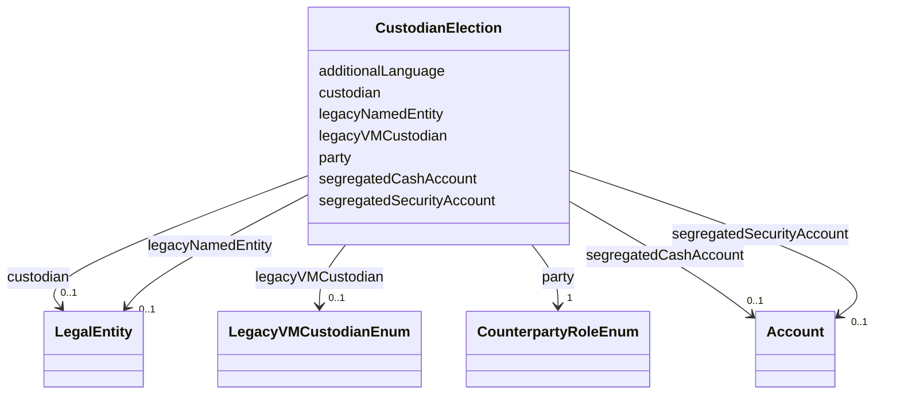

```mermaid
 classDiagram
    class CustodianElection
    click CustodianElection href "../CustodianElection"
      CustodianElection : additionalLanguage
        
      CustodianElection : custodian
        
          
    
        
        
        CustodianElection --> "0..1" LegalEntity : custodian
        click LegalEntity href "../LegalEntity"
    

        
      CustodianElection : legacyNamedEntity
        
          
    
        
        
        CustodianElection --> "0..1" LegalEntity : legacyNamedEntity
        click LegalEntity href "../LegalEntity"
    

        
      CustodianElection : legacyVMCustodian
        
          
    
        
        
        CustodianElection --> "0..1" LegacyVMCustodianEnum : legacyVMCustodian
        click LegacyVMCustodianEnum href "../LegacyVMCustodianEnum"
    

        
      CustodianElection : party
        
          
    
        
        
        CustodianElection --> "1" CounterpartyRoleEnum : party
        click CounterpartyRoleEnum href "../CounterpartyRoleEnum"
    

        
      CustodianElection : segregatedCashAccount
        
          
    
        
        
        CustodianElection --> "0..1" Account : segregatedCashAccount
        click Account href "../Account"
    

        
      CustodianElection : segregatedSecurityAccount
        
          
    
        
        
        CustodianElection --> "0..1" Account : segregatedSecurityAccount
        click Account href "../Account"
    

        
      
```
