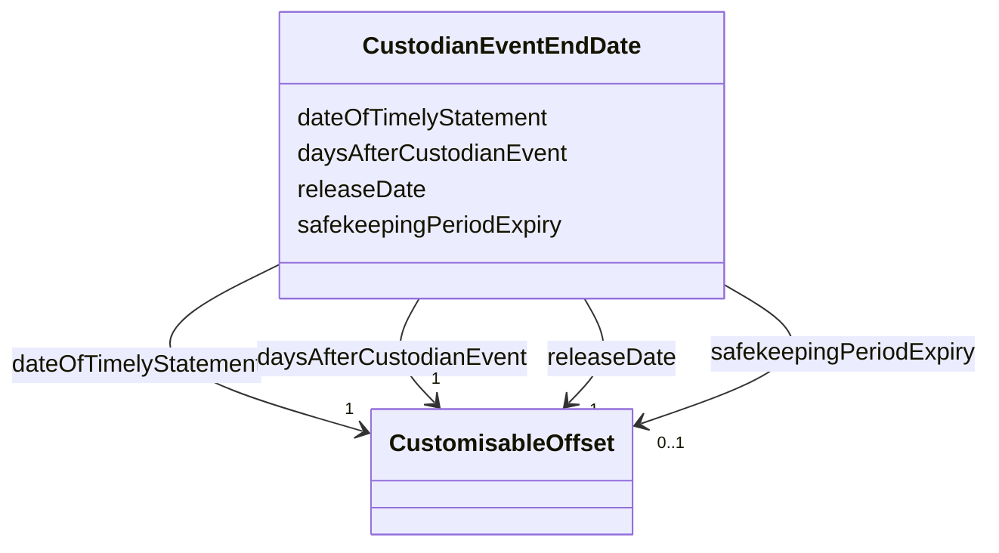

```mermaid
 classDiagram
    class CustodianEventEndDate
    click CustodianEventEndDate href "../CustodianEventEndDate"
      CustodianEventEndDate : dateOfTimelyStatement
        
          
    
        
        
        CustodianEventEndDate --> "1" CustomisableOffset : dateOfTimelyStatement
        click CustomisableOffset href "../CustomisableOffset"
    

        
      CustodianEventEndDate : daysAfterCustodianEvent
        
          
    
        
        
        CustodianEventEndDate --> "1" CustomisableOffset : daysAfterCustodianEvent
        click CustomisableOffset href "../CustomisableOffset"
    

        
      CustodianEventEndDate : releaseDate
        
          
    
        
        
        CustodianEventEndDate --> "1" CustomisableOffset : releaseDate
        click CustomisableOffset href "../CustomisableOffset"
    

        
      CustodianEventEndDate : safekeepingPeriodExpiry
        
          
    
        
        
        CustodianEventEndDate --> "0..1" CustomisableOffset : safekeepingPeriodExpiry
        click CustomisableOffset href "../CustomisableOffset"
    

        
      
```
