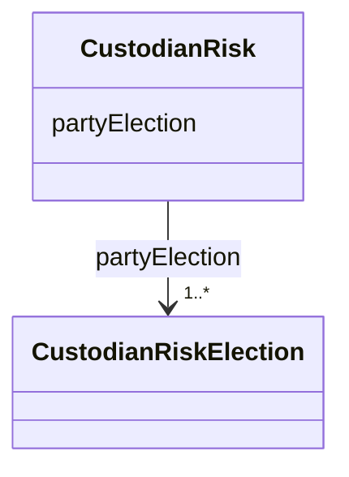

```mermaid
 classDiagram
    class CustodianRisk
    click CustodianRisk href "../CustodianRisk"
      CustodianRisk : partyElection
        
          
    
        
        
        CustodianRisk --> "1..*" CustodianRiskElection : partyElection
        click CustodianRiskElection href "../CustodianRiskElection"
    

        
      
```
