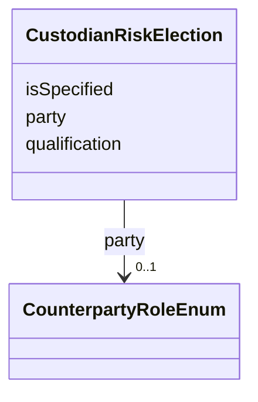

```mermaid
 classDiagram
    class CustodianRiskElection
    click CustodianRiskElection href "../CustodianRiskElection"
      CustodianRiskElection : isSpecified
        
      CustodianRiskElection : party
        
          
    
        
        
        CustodianRiskElection --> "0..1" CounterpartyRoleEnum : party
        click CounterpartyRoleEnum href "../CounterpartyRoleEnum"
    

        
      CustodianRiskElection : qualification
        
      
```
