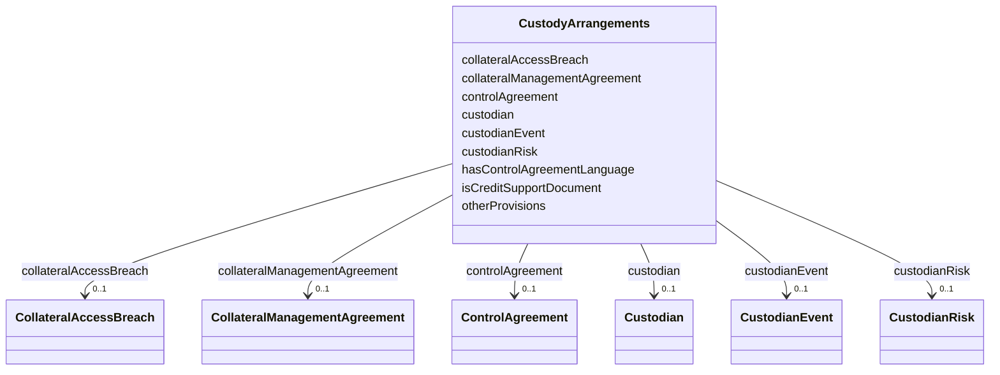

```mermaid
 classDiagram
    class CustodyArrangements
    click CustodyArrangements href "../CustodyArrangements"
      CustodyArrangements : collateralAccessBreach
        
          
    
        
        
        CustodyArrangements --> "0..1" CollateralAccessBreach : collateralAccessBreach
        click CollateralAccessBreach href "../CollateralAccessBreach"
    

        
      CustodyArrangements : collateralManagementAgreement
        
          
    
        
        
        CustodyArrangements --> "0..1" CollateralManagementAgreement : collateralManagementAgreement
        click CollateralManagementAgreement href "../CollateralManagementAgreement"
    

        
      CustodyArrangements : controlAgreement
        
          
    
        
        
        CustodyArrangements --> "0..1" ControlAgreement : controlAgreement
        click ControlAgreement href "../ControlAgreement"
    

        
      CustodyArrangements : custodian
        
          
    
        
        
        CustodyArrangements --> "0..1" Custodian : custodian
        click Custodian href "../Custodian"
    

        
      CustodyArrangements : custodianEvent
        
          
    
        
        
        CustodyArrangements --> "0..1" CustodianEvent : custodianEvent
        click CustodianEvent href "../CustodianEvent"
    

        
      CustodyArrangements : custodianRisk
        
          
    
        
        
        CustodyArrangements --> "0..1" CustodianRisk : custodianRisk
        click CustodianRisk href "../CustodianRisk"
    

        
      CustodyArrangements : hasControlAgreementLanguage
        
      CustodyArrangements : isCreditSupportDocument
        
      CustodyArrangements : otherProvisions
        
      
```
