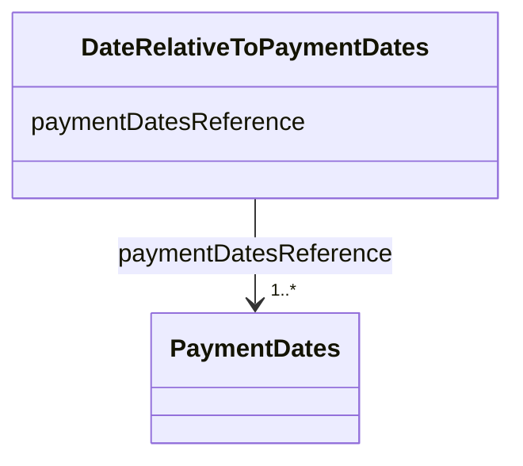

```mermaid
 classDiagram
    class DateRelativeToPaymentDates
    click DateRelativeToPaymentDates href "../DateRelativeToPaymentDates"
      DateRelativeToPaymentDates : paymentDatesReference
        
          
    
        
        
        DateRelativeToPaymentDates --> "1..*" PaymentDates : paymentDatesReference
        click PaymentDates href "../PaymentDates"
    

        
      
```
