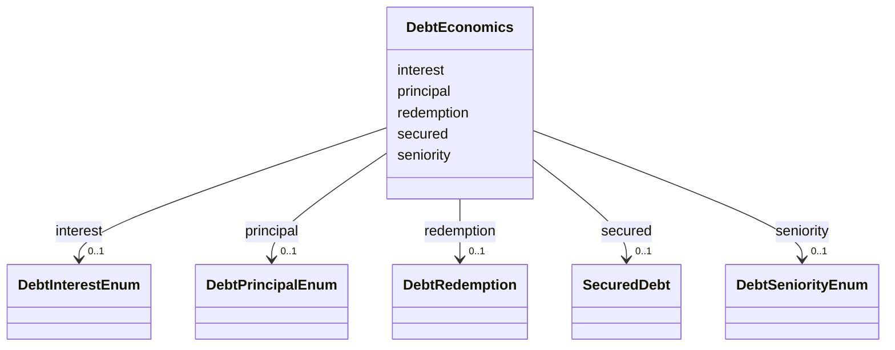

```mermaid
 classDiagram
    class DebtEconomics
    click DebtEconomics href "../DebtEconomics"
      DebtEconomics : interest
        
          
    
        
        
        DebtEconomics --> "0..1" DebtInterestEnum : interest
        click DebtInterestEnum href "../DebtInterestEnum"
    

        
      DebtEconomics : principal
        
          
    
        
        
        DebtEconomics --> "0..1" DebtPrincipalEnum : principal
        click DebtPrincipalEnum href "../DebtPrincipalEnum"
    

        
      DebtEconomics : redemption
        
          
    
        
        
        DebtEconomics --> "0..1" DebtRedemption : redemption
        click DebtRedemption href "../DebtRedemption"
    

        
      DebtEconomics : secured
        
          
    
        
        
        DebtEconomics --> "0..1" SecuredDebt : secured
        click SecuredDebt href "../SecuredDebt"
    

        
      DebtEconomics : seniority
        
          
    
        
        
        DebtEconomics --> "0..1" DebtSeniorityEnum : seniority
        click DebtSeniorityEnum href "../DebtSeniorityEnum"
    

        
      
```
