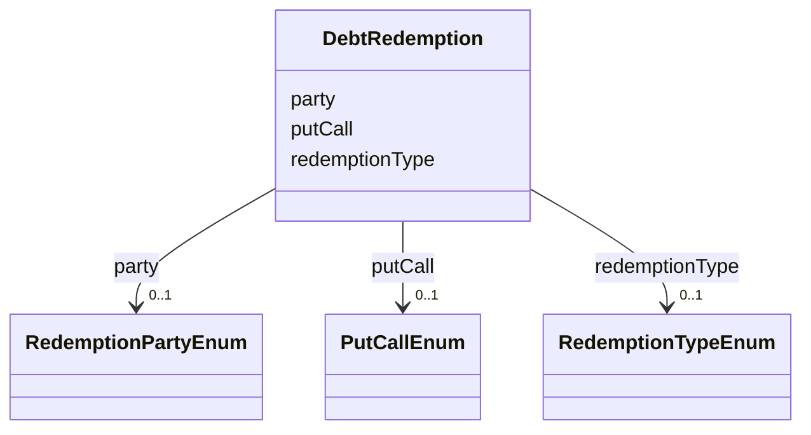

```mermaid
 classDiagram
    class DebtRedemption
    click DebtRedemption href "../DebtRedemption"
      DebtRedemption : party
        
          
    
        
        
        DebtRedemption --> "0..1" RedemptionPartyEnum : party
        click RedemptionPartyEnum href "../RedemptionPartyEnum"
    

        
      DebtRedemption : putCall
        
          
    
        
        
        DebtRedemption --> "0..1" PutCallEnum : putCall
        click PutCallEnum href "../PutCallEnum"
    

        
      DebtRedemption : redemptionType
        
          
    
        
        
        DebtRedemption --> "0..1" RedemptionTypeEnum : redemptionType
        click RedemptionTypeEnum href "../RedemptionTypeEnum"
    

        
      
```
