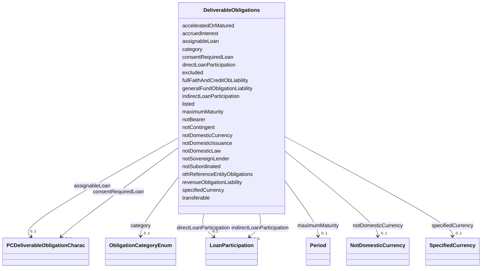

```mermaid
 classDiagram
    class DeliverableObligations
    click DeliverableObligations href "../DeliverableObligations"
      DeliverableObligations : acceleratedOrMatured
        
      DeliverableObligations : accruedInterest
        
      DeliverableObligations : assignableLoan
        
          
    
        
        
        DeliverableObligations --> "0..1" PCDeliverableObligationCharac : assignableLoan
        click PCDeliverableObligationCharac href "../PCDeliverableObligationCharac"
    

        
      DeliverableObligations : category
        
          
    
        
        
        DeliverableObligations --> "0..1" ObligationCategoryEnum : category
        click ObligationCategoryEnum href "../ObligationCategoryEnum"
    

        
      DeliverableObligations : consentRequiredLoan
        
          
    
        
        
        DeliverableObligations --> "0..1" PCDeliverableObligationCharac : consentRequiredLoan
        click PCDeliverableObligationCharac href "../PCDeliverableObligationCharac"
    

        
      DeliverableObligations : directLoanParticipation
        
          
    
        
        
        DeliverableObligations --> "0..1" LoanParticipation : directLoanParticipation
        click LoanParticipation href "../LoanParticipation"
    

        
      DeliverableObligations : excluded
        
      DeliverableObligations : fullFaithAndCreditObLiability
        
      DeliverableObligations : generalFundObligationLiability
        
      DeliverableObligations : indirectLoanParticipation
        
          
    
        
        
        DeliverableObligations --> "0..1" LoanParticipation : indirectLoanParticipation
        click LoanParticipation href "../LoanParticipation"
    

        
      DeliverableObligations : listed
        
      DeliverableObligations : maximumMaturity
        
          
    
        
        
        DeliverableObligations --> "0..1" Period : maximumMaturity
        click Period href "../Period"
    

        
      DeliverableObligations : notBearer
        
      DeliverableObligations : notContingent
        
      DeliverableObligations : notDomesticCurrency
        
          
    
        
        
        DeliverableObligations --> "0..1" NotDomesticCurrency : notDomesticCurrency
        click NotDomesticCurrency href "../NotDomesticCurrency"
    

        
      DeliverableObligations : notDomesticIssuance
        
      DeliverableObligations : notDomesticLaw
        
      DeliverableObligations : notSovereignLender
        
      DeliverableObligations : notSubordinated
        
      DeliverableObligations : othReferenceEntityObligations
        
      DeliverableObligations : revenueObligationLiability
        
      DeliverableObligations : specifiedCurrency
        
          
    
        
        
        DeliverableObligations --> "0..1" SpecifiedCurrency : specifiedCurrency
        click SpecifiedCurrency href "../SpecifiedCurrency"
    

        
      DeliverableObligations : transferable
        
      
```
