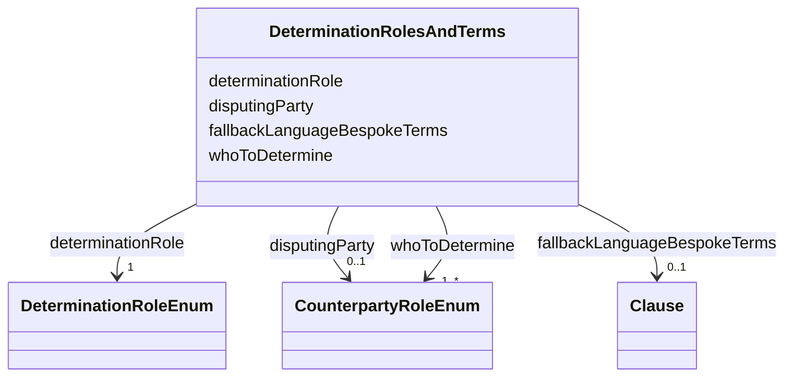

```mermaid
 classDiagram
    class DeterminationRolesAndTerms
    click DeterminationRolesAndTerms href "../DeterminationRolesAndTerms"
      DeterminationRolesAndTerms : determinationRole
        
          
    
        
        
        DeterminationRolesAndTerms --> "1" DeterminationRoleEnum : determinationRole
        click DeterminationRoleEnum href "../DeterminationRoleEnum"
    

        
      DeterminationRolesAndTerms : disputingParty
        
          
    
        
        
        DeterminationRolesAndTerms --> "0..1" CounterpartyRoleEnum : disputingParty
        click CounterpartyRoleEnum href "../CounterpartyRoleEnum"
    

        
      DeterminationRolesAndTerms : fallbackLanguageBespokeTerms
        
          
    
        
        
        DeterminationRolesAndTerms --> "0..1" Clause : fallbackLanguageBespokeTerms
        click Clause href "../Clause"
    

        
      DeterminationRolesAndTerms : whoToDetermine
        
          
    
        
        
        DeterminationRolesAndTerms --> "1..*" CounterpartyRoleEnum : whoToDetermine
        click CounterpartyRoleEnum href "../CounterpartyRoleEnum"
    

        
      
```
