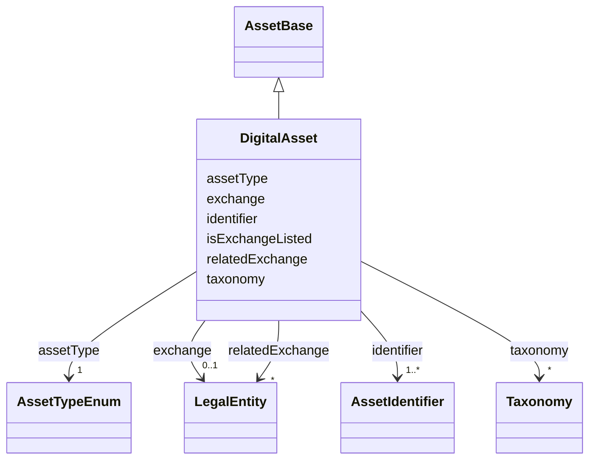

```mermaid
 classDiagram
    class DigitalAsset
    click DigitalAsset href "../DigitalAsset"
      AssetBase <|-- DigitalAsset
        click AssetBase href "../AssetBase"
      
      DigitalAsset : assetType
        
          
    
        
        
        DigitalAsset --> "1" AssetTypeEnum : assetType
        click AssetTypeEnum href "../AssetTypeEnum"
    

        
      DigitalAsset : exchange
        
          
    
        
        
        DigitalAsset --> "0..1" LegalEntity : exchange
        click LegalEntity href "../LegalEntity"
    

        
      DigitalAsset : identifier
        
          
    
        
        
        DigitalAsset --> "1..*" AssetIdentifier : identifier
        click AssetIdentifier href "../AssetIdentifier"
    

        
      DigitalAsset : isExchangeListed
        
      DigitalAsset : relatedExchange
        
          
    
        
        
        DigitalAsset --> "*" LegalEntity : relatedExchange
        click LegalEntity href "../LegalEntity"
    

        
      DigitalAsset : taxonomy
        
          
    
        
        
        DigitalAsset --> "*" Taxonomy : taxonomy
        click Taxonomy href "../Taxonomy"
    

        
      
```
