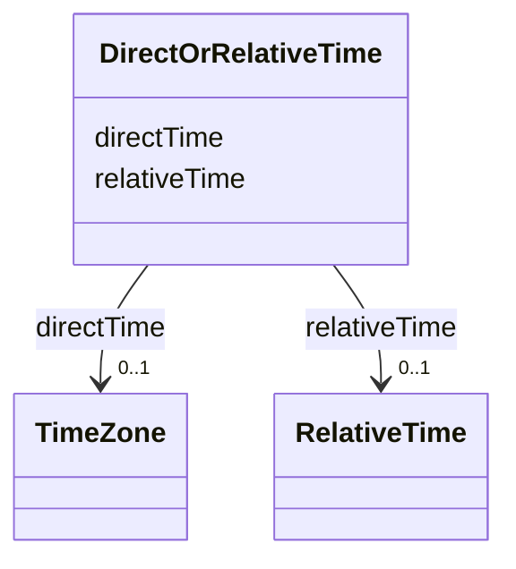

```mermaid
 classDiagram
    class DirectOrRelativeTime
    click DirectOrRelativeTime href "../DirectOrRelativeTime"
      DirectOrRelativeTime : directTime
        
          
    
        
        
        DirectOrRelativeTime --> "0..1" TimeZone : directTime
        click TimeZone href "../TimeZone"
    

        
      DirectOrRelativeTime : relativeTime
        
          
    
        
        
        DirectOrRelativeTime --> "0..1" RelativeTime : relativeTime
        click RelativeTime href "../RelativeTime"
    

        
      
```
