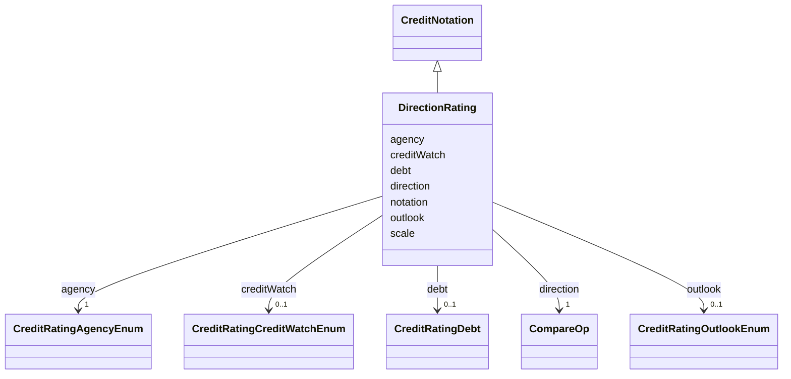

```mermaid
 classDiagram
    class DirectionRating
    click DirectionRating href "../DirectionRating"
      CreditNotation <|-- DirectionRating
        click CreditNotation href "../CreditNotation"
      
      DirectionRating : agency
        
          
    
        
        
        DirectionRating --> "1" CreditRatingAgencyEnum : agency
        click CreditRatingAgencyEnum href "../CreditRatingAgencyEnum"
    

        
      DirectionRating : creditWatch
        
          
    
        
        
        DirectionRating --> "0..1" CreditRatingCreditWatchEnum : creditWatch
        click CreditRatingCreditWatchEnum href "../CreditRatingCreditWatchEnum"
    

        
      DirectionRating : debt
        
          
    
        
        
        DirectionRating --> "0..1" CreditRatingDebt : debt
        click CreditRatingDebt href "../CreditRatingDebt"
    

        
      DirectionRating : direction
        
          
    
        
        
        DirectionRating --> "1" CompareOp : direction
        click CompareOp href "../CompareOp"
    

        
      DirectionRating : notation
        
      DirectionRating : outlook
        
          
    
        
        
        DirectionRating --> "0..1" CreditRatingOutlookEnum : outlook
        click CreditRatingOutlookEnum href "../CreditRatingOutlookEnum"
    

        
      DirectionRating : scale
        
      
```
