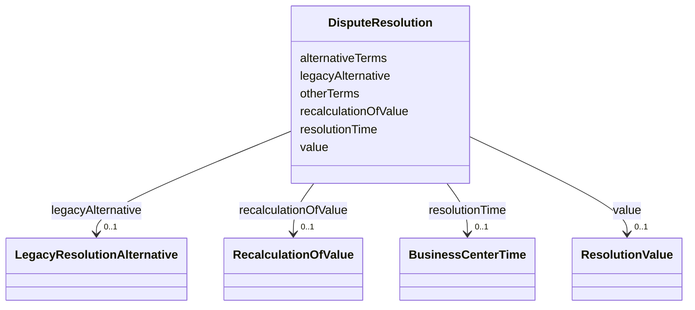

```mermaid
 classDiagram
    class DisputeResolution
    click DisputeResolution href "../DisputeResolution"
      DisputeResolution : alternativeTerms
        
      DisputeResolution : legacyAlternative
        
          
    
        
        
        DisputeResolution --> "0..1" LegacyResolutionAlternative : legacyAlternative
        click LegacyResolutionAlternative href "../LegacyResolutionAlternative"
    

        
      DisputeResolution : otherTerms
        
      DisputeResolution : recalculationOfValue
        
          
    
        
        
        DisputeResolution --> "0..1" RecalculationOfValue : recalculationOfValue
        click RecalculationOfValue href "../RecalculationOfValue"
    

        
      DisputeResolution : resolutionTime
        
          
    
        
        
        DisputeResolution --> "0..1" BusinessCenterTime : resolutionTime
        click BusinessCenterTime href "../BusinessCenterTime"
    

        
      DisputeResolution : value
        
          
    
        
        
        DisputeResolution --> "0..1" ResolutionValue : value
        click ResolutionValue href "../ResolutionValue"
    

        
      
```
