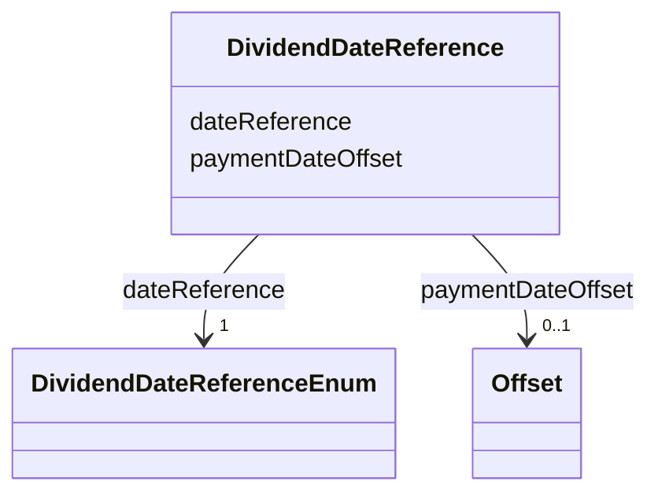

```mermaid
 classDiagram
    class DividendDateReference
    click DividendDateReference href "../DividendDateReference"
      DividendDateReference : dateReference
        
          
    
        
        
        DividendDateReference --> "1" DividendDateReferenceEnum : dateReference
        click DividendDateReferenceEnum href "../DividendDateReferenceEnum"
    

        
      DividendDateReference : paymentDateOffset
        
          
    
        
        
        DividendDateReference --> "0..1" Offset : paymentDateOffset
        click Offset href "../Offset"
    

        
      
```
