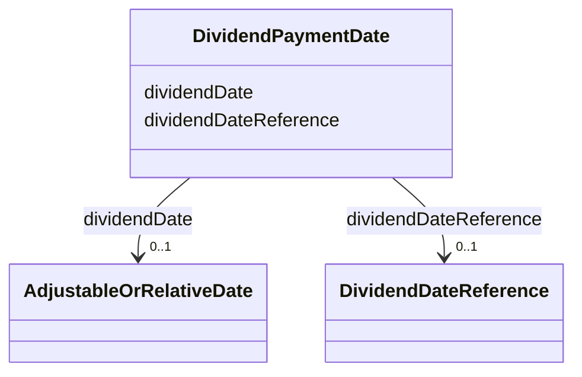

```mermaid
 classDiagram
    class DividendPaymentDate
    click DividendPaymentDate href "../DividendPaymentDate"
      DividendPaymentDate : dividendDate
        
          
    
        
        
        DividendPaymentDate --> "0..1" AdjustableOrRelativeDate : dividendDate
        click AdjustableOrRelativeDate href "../AdjustableOrRelativeDate"
    

        
      DividendPaymentDate : dividendDateReference
        
          
    
        
        
        DividendPaymentDate --> "0..1" DividendDateReference : dividendDateReference
        click DividendDateReference href "../DividendDateReference"
    

        
      
```
