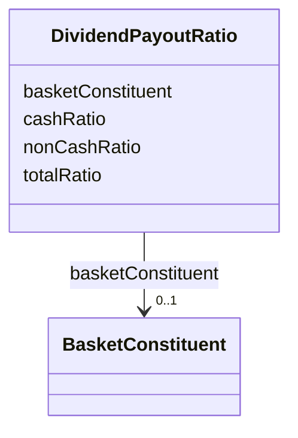

```mermaid
 classDiagram
    class DividendPayoutRatio
    click DividendPayoutRatio href "../DividendPayoutRatio"
      DividendPayoutRatio : basketConstituent
        
          
    
        
        
        DividendPayoutRatio --> "0..1" BasketConstituent : basketConstituent
        click BasketConstituent href "../BasketConstituent"
    

        
      DividendPayoutRatio : cashRatio
        
      DividendPayoutRatio : nonCashRatio
        
      DividendPayoutRatio : totalRatio
        
      
```
